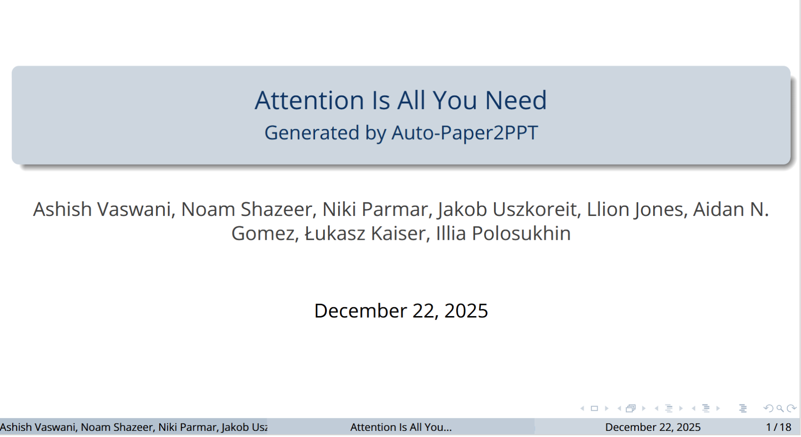
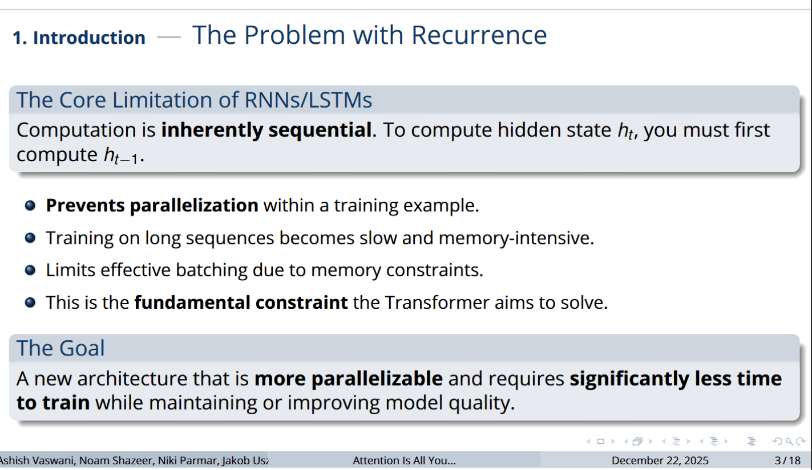
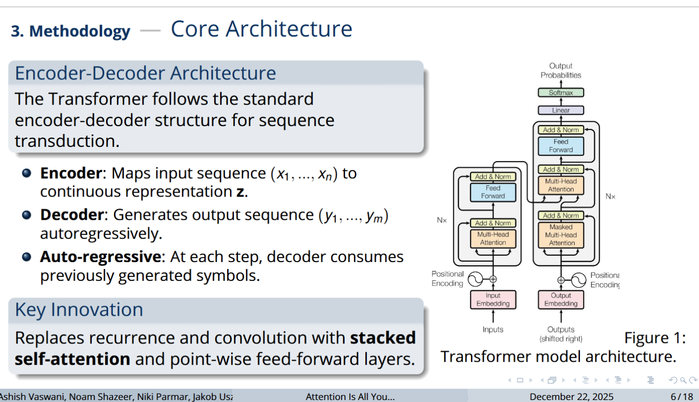
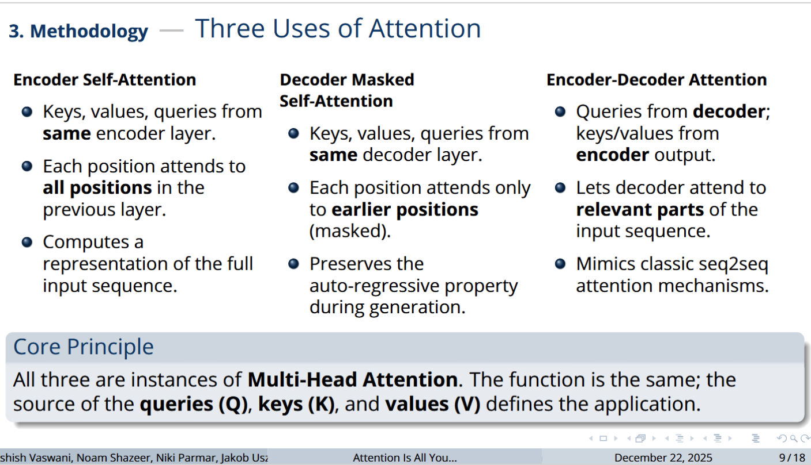
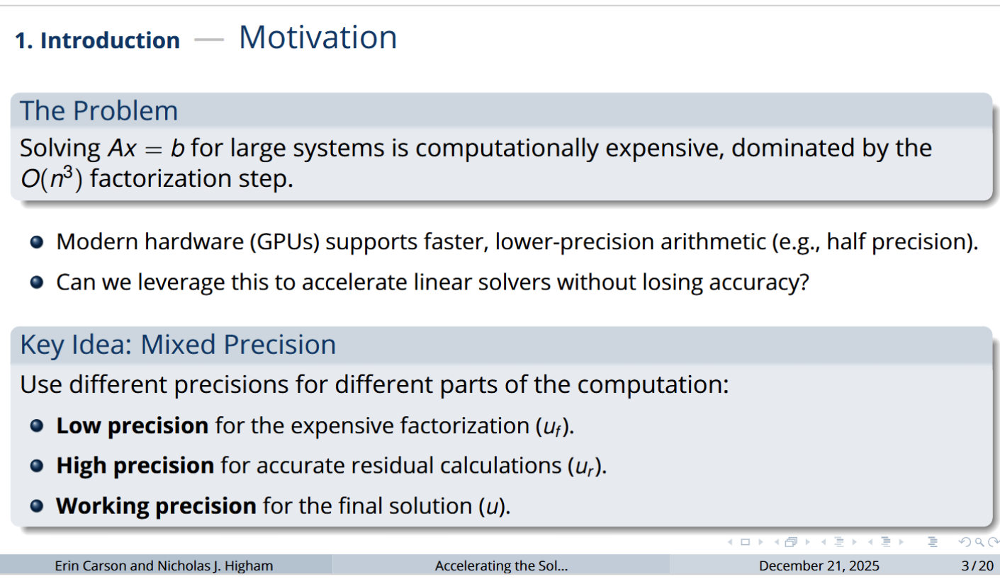
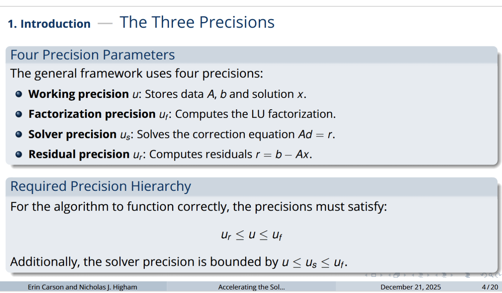
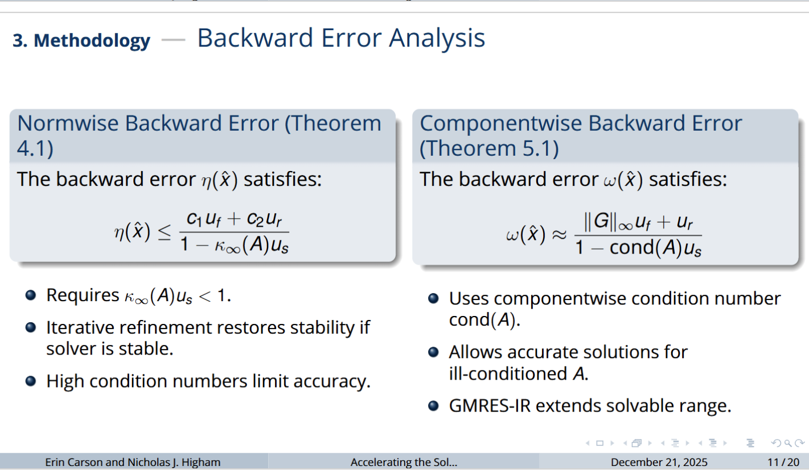
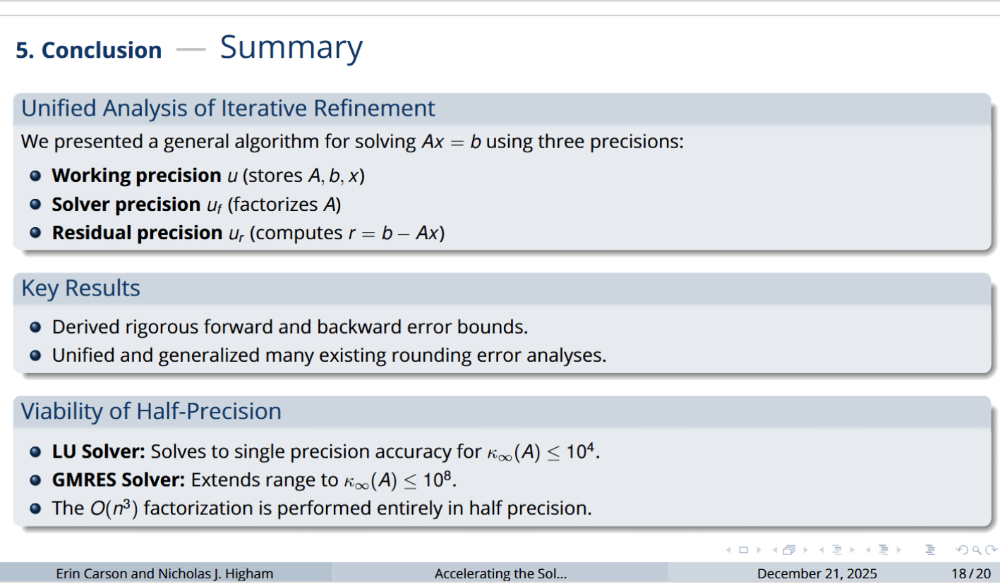
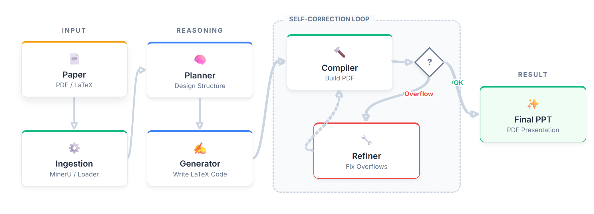

# Paper2PPT

[](https://opensource.org/licenses/MIT)
[](https://www.python.org/downloads/)

[中文](./README_zh.md) | [English](./README.md)

**Paper2PPT** 是一个智能自动化工具，旨在将学术论文（PDF 或 LaTeX 源码）转换为专业的 PDF 演示文稿。它利用大语言模型（LLM）的强大能力来理解论文内容，提取关键信息，并生成结构清晰、内容丰富的幻灯片。

## 🖼️ 效果展示

以下是 Paper2PPT 生成的演示文稿示例。

<table>
  <tr>
    <th colspan="4" align="center">Attention Is All You Need</th>
  </tr>
  <tr>
    <td width="25%"></td>
    <td width="25%"></td>
    <td width="25%"></td>
    <td width="25%"></td>
  </tr>
  <tr>
    <th colspan="4" align="center">IR3 (混合精度 GMRES)</th>
  </tr>
  <tr>
    <td width="25%"></td>
    <td width="25%"></td>
    <td width="25%"></td>
    <td width="25%"></td>
  </tr>
</table>

> 您可以在 `output/` 目录下找到这些示例的完整生成演示文稿，以亲自评估效果。

## ✨ 功能特点

- **多格式支持**：无缝支持 PDF 文档和 LaTeX 项目文件夹作为输入。
- **智能提取**：利用 `mineru` 和自定义加载器精确提取论文文本和结构信息。
- **自动化流程**：包含规划（Planner）、生成（Generator）和优化（Refiner）三个稳健阶段。
- **交互式 CLI**：提供友好的命令行界面，方便选择论文和设置演讲时长。
- **高度可定制**：生成标准的 LaTeX 代码，可进一步手动编辑和编译以获得完美效果。

## 🧠 工作流程



## 📂 目录结构说明

在使用前，请熟悉以下关键目录：

- **`paper/`**: 存放输入论文的目录。
    - `paper/pdf/`: 将 PDF 格式的论文放在这里。
    - `paper/tex/`: 将 LaTeX 项目文件夹放在这里。
- **`output/`**: 生成的演示文稿将保存在这里。
- **`.env.example`**: `.env` 的示例配置文件。

## 🛠️ 安装指南

本项目支持使用 **Conda** 或 **Python venv** 进行环境配置。

### 前置要求

- **Python 3.12+**
- **LaTeX 发行版** (如 TeX Live 或 MiKTeX)，用于编译生成的 `.tex` 文件。
- **建议使用 GPU**：为了获得最佳性能，建议配备 GPU（作者在 V100 16G 上测试通过）。

### 方式一：使用 Conda (推荐)

1.  **创建并激活环境**
    ```bash
    conda create -n paper2ppt python=3.12
    conda activate paper2ppt
    ```

2.  **安装依赖**
    ```bash
    pip install -r requirements.txt
    ```

### 方式二：使用 venv

1.  **创建虚拟环境**
    ```bash
    python -m venv venv
    ```

2.  **激活环境**
    - Linux/macOS:
        ```bash
        source venv/bin/activate
        ```
    - Windows:
        ```bash
        .\venv\Scripts\activate
        ```

3.  **安装依赖**
    ```bash
    pip install -r requirements.txt
    ```

> **💡 提示**：如果您在中国大陆地区使用，建议配置 Hugging Face 镜像以避免网络问题（`mineru` 需要下载模型）：
> ```bash
> export HF_ENDPOINT=https://hf-mirror.com
> ```

## ⚙️ 配置

在项目根目录下创建一个 `.env` 文件，配置 LLM 相关的环境变量。您可以直接复制提供的 `.env.example` 文件：

```bash
cp .env.example .env
```

**示例 `.env` 文件内容：**

```env
# Standardized Configuration
API_PROVIDER=deepseek
MODEL_NAME=deepseek-chat
LLM_API_KEY=your_api_key_here
LLM_API_BASE=https://api.deepseek.com
MAX_OUTPUT_TOKENS=6000
PDF_PARSE_METHOD=auto
```

## 🚀 使用方法

1.  **准备数据**
    - 如果你有 PDF 论文，将其放入 `paper/pdf/` 目录。
    - 如果你有 LaTeX 源码，将其解压并放入 `paper/tex/` 下的子目录中（例如 `paper/tex/attention_is_all_you_need/`）。

2.  **运行程序**
    确保已激活 Python 环境，然后在项目根目录运行：

    ```bash
    python main.py
    ```

3.  **交互式操作**
    - 程序会自动扫描 `paper/` 目录下的可用论文。
    - 根据提示输入数字选择要转换的论文。
    - 输入期望的演讲时长（分钟），例如 `25`。

4.  **获取结果**
    - 程序运行完成后，结果将生成在 `output/` 目录下（例如 `output/<论文名>_pdf/`）。
    - 进入输出目录，使用 LaTeX 编译器编译 `presentation.tex` 即可得到 PDF 幻灯片：
        ```bash
        cd output/your_paper_folder
        pdflatex presentation.tex
        # 或者
        latexmk -pdf presentation.tex
        ```

## 待办事项 (Todo List)

- [ ] **自动化图表生成**：使用 Python 根据论文数据自动化生成学术风格的展示图进行插入，使 PPT 更美观直观。
- [ ] **AI 图像生成**：使用 Diffusion 模型生成一些形象化的展示图，提升 PPT 的视觉效果。
- [ ] **Windows 支持**：增加对 Windows 环境的完整支持。
- [ ] **GUI 界面**：提供图形用户界面，降低使用门槛。
- [ ] **更多交互功能**：增加更多生成过程中的交互式功能。
- [ ] **更多主题**：提供更多样化的 PPT 主题和模板。

## 📄 许可证

本项目采用 MIT 许可证 - 详情请参阅 [LICENSE](LICENSE) 文件。
