# ACCELERATING THE SOLUTION OF LINEAR SYSTEMS BY ITERATIVE REFINEMENT IN THREE PRECISIONS $^ *$

ERIN CARSON† AND NICHOLAS J. HIGHAM $^ { \ddagger }$

Abstract. We propose a general algorithm for solving an $n \times n$ nonsingular linear system $A x = b$ based on iterative refinement with three precisions. The working precision is combined with possibly different precisions for solving for the correction term and for computing the residuals. Via rounding error analysis of the algorithm we derive sufficient conditions for convergence and bounds for the attainable forward error and normwise and componentwise backward errors. Our results generalize and unify many existing rounding error analyses for iterative refinement. With single precision as the working precision, we show that by using LU factorization in IEEE half precision as the solver and calculating the residuals in double precision it is possible to solve $A x = b$ to full single precision accuracy for $\infty$ -norm condition numbers $\kappa _ { \infty } ( A ) \leq 1 0 ^ { 4 }$ , with the $O ( n ^ { 3 } )$ part of the computations carried out entirely in half precision. We show further that by solving the correction equations by GMRES preconditioned by the LU factors the restriction on the condition number can be weakened to $\kappa _ { \infty } ( A ) \leq 1 0 ^ { 8 }$ , although in general there is no guarantee that GMRES will converge quickly. Taking for comparison a standard $A x = b$ solver that uses LU factorization in single precision, these results suggest that on architectures for which half precision is efficiently implemented it will be possible to solve certain linear systems $A x = b$ up to twice as fast and to greater accuracy. Analogous results are given with double precision as the working precision.

Key words. iterative refinement, linear system, multiple precision, mixed precision, rounding error analysis, backward error, forward error, GMRES, preconditioning

AMS subject classifications. 65G50, 65F10

DOI. 10.1137/17M1140819

1. Introduction. Iterative refinement is a method for improving an approximate solution $y$ to a linear system $A x = b$ by computing the residual $r = b - A y$ , solving the correction equation $A d = r$ , forming the update $y  y + d$ , and repeating these steps as necessary. We consider a general iterative refinement algorithm that includes a variety of existing ones as special cases. The algorithm contains three precisions:

• $u$ is the precision at which the data $A , b$ and the solution $x$ are stored (the working precision),   
• $u _ { f }$ is the precision at which the factorization of $A$ is computed,   
• $u _ { r }$ is the precision at which residuals are computed.

The precisions are assumed to satisfy

$$
u _ { r } \leq u \leq u _ { f } .
$$

The algorithm also contains a fourth precision:

• $u _ { s }$ is the precision at which the correction equation is (effectively) solved, with $u \leq u _ { s } \leq u _ { f }$ .

Whereas $u$ , $u _ { f }$ , and $u _ { r }$ are intended to be possibly different precisions supported by the computing environment (ideally the hardware), $u _ { s }$ is essentially a parameter that describes how accurately the correction equation is solved; it will take the value $u _ { f }$ or $u$ in the cases of interest.

ALGORITHM 1.1. Let the nonsingular matrix $A \in \mathbb { R } ^ { n \times n }$ and $b \in \mathbb { R } ^ { n }$ be given in precision $u$ . This algorithm uses iterative refinement to generate a sequence of approximations $x _ { i }$ , all stored in precision $u$ , to the solution of $A x = b$ .

1 Solve $A x _ { 0 } = b$ in precision $u _ { f }$ and store $x _ { 0 }$ at precision $u$ .   
2 for $i = 0 \colon \infty$   
3 Compute $r _ { i } = b - A x _ { i }$ at precision $u _ { r }$ and round $r _ { i }$ to precision $u _ { s }$ .   
4 Solve $A d _ { i } = r _ { i }$ at precision $u _ { s }$ and store $d _ { i }$ at precision $u$ .   
5 $x _ { i + 1 } = x _ { i } + d _ { i }$ at precision $u$ .   
6 end

Note that a different solver can be used in step 1 than in step 4. In practice, these solvers will be related, so although the precision $u _ { f }$ does not appear in the loop, information computed in step 1 at precision $\boldsymbol { u } _ { f }$ will be used in step 4.

Algorithm 1.1 includes as special cases both old and more recent forms of iterative refinement, as we now explain.

In traditional iterative refinement the solver is LU factorization and residuals are computed at twice the working precision, which corresponds to $u _ { f } ~ = ~ u _ { s } ~ = ~ u$ and $u _ { r } = u ^ { 2 }$ . This form of iterative refinement was programmed by Wilkinson in 1948 [38] and used at that time by Wilkinson and his colleagues on desk calculating machines and Hollerith punched card machines [13], [40]. It was in common use up until the 1970s, owing to the fact that inner products could be cheaply accumulated at twice the working precision on many computers of that era. Early error analyses were given by Wilkinson for fixed point arithmetic [39] and Moler [27] for floating point arithmetic.

In fixed precision refinement all computations are at the same precision: $u _ { f } =$ $u _ { s } = u = u _ { r }$ . This form of refinement started to be considered in the 1970s and was analyzed by Jankowski and Wozniakowski [22] for a general solver and by Skeel [34] for LU factorization. Higham [17] extended Skeel's analysis to a general solver and in [18] gave a further extension to allow for residuals computed in extra precision. LAPACK [4] implements fixed precision iterative refinement.

In the 2000s iterative refinement attracted renewed interest because on modern computer architectures single precision arithmetic is usually at least twice as fast as double precision arithmetic. With the base precision $u$ equal to double precision, $u _ { f }$ and $u _ { s }$ equal to single precision, $u _ { r } = u$ , and a solver based on LU factorization, the most expensive part of the computation is done entirely in single precision. This usage was proposed and analyzed by Langou et al. [24] and has been exploited extensively by Dongarra and his coauthors; see [1, sect. 9] for a recent overview and further references.

Error analyses of the methods above all require $A$ to be safely bounded away from singularity relative to the working precision. Carson and Higham [9] give a new forward error analysis of iterative refinement that identifies a mechanism that allows accurate solutions to be obtained to systems for which $A$ has condition number as large as the order of the reciprocal of the unit roundoff. Their analysis requires the update equation in line 4 of Algorithm 1.1 to be solved with relative error less than

TABLE 1.1 Summary of existing rounding error analyses for iterative refinement in floating point arithmetic indicating (a) whether the analyses apply to $L U$ factorization only or to an arbitrary solver, (b) whether the backward or forward error analyses are componentwise ("comp") or normwise ("norm"), and (c) the assumptions on the precisions $\boldsymbol { u } _ { f }$ , $\boldsymbol { u } _ { s }$ , $^ u$ , $u _ { r }$ in Algorithm 1.1 $\boldsymbol { u } _ { f } ~ = ~ \boldsymbol { u }$ and $\ b u _ { s } = \ b u _ { f }$ unless otherwise stated).   

<table><tr><td></td><td></td><td>Solver</td><td>Forward</td><td>Backward</td><td></td></tr><tr><td>Moler [27]</td><td>Year 1967</td><td>LU</td><td>error norm</td><td>error</td><td>Precisions u ≥ ur</td></tr><tr><td>Stewart [36]</td><td>1973</td><td>LU</td><td></td><td>− −</td><td>u ≥ ur</td></tr><tr><td></td><td>1977</td><td>arb.</td><td>norm</td><td></td><td></td></tr><tr><td>Jankowski et al. [22]</td><td>1980</td><td>LU</td><td>norm</td><td>norm</td><td>u = ur</td></tr><tr><td>Skeel [34]</td><td>1991</td><td>arb.</td><td>comp</td><td>comp</td><td>u ≥ ur</td></tr><tr><td>Higham [17]</td><td>1997</td><td>arb.</td><td>comp</td><td>comp</td><td>u = ur</td></tr><tr><td>Higham [18], [19] Tisseur [37]</td><td>2001</td><td>arb.</td><td>comp</td><td>comp</td><td>u ≥ ur</td></tr><tr><td>Langou et al. [24]</td><td>2006</td><td>LU</td><td>norm</td><td>norm</td><td>u ≥ ur</td></tr><tr><td></td><td>2017</td><td>arb.</td><td>norm</td><td>norm</td><td>uf ≥ u = ur</td></tr><tr><td>Carson and Higham [9] This work</td><td>2017</td><td>arb.</td><td>comp comp</td><td>− comp, norm</td><td>u ≥ ur uf ≥ us ≥ u ≥ ur</td></tr></table>

1. They achieve this by the use of GMRES preconditioned with the LU factors. They prove that if the application of the preconditioned operator is performed in precision $u ^ { 2 }$ , then the GMRES backward stability results of Paige, Rozlozník, and Strako [31] hold for the preconditioned system; see [9, eq. (3.6)]. This result is then used to prove that the update equation is solved with some degree of relative accuracy, even in the case that $A$ is extremely ill conditioned.

Table 1.1 summarizes the main existing foating point error analyses. In the table we categorize a forward error bound as componentwise if it employs the condition numbers $\operatorname { c o n d } ( A )$ or $\operatorname { c o n d } ( A , x )$ defined in (2.2) below and normwise if it only employs $\kappa _ { \infty } ( A )$ defined in (2.1). A backward error analysis is classed as componentwise or normwise according to whether it bounds the absolute value or the norm of the residual vector (we do not regard a componentwise analysis as implying a normwise one, as simply taking norms in a componentwise bound does not necessarily yield the strongest normwise result).

Half precision (16-bit) floating point arithmetic, defined as a storage format in the 2008 revision of the IEEE standard [21], is now starting to become available in hardware, for example, in the NVIDIA P100 and V100 GPUs and the AMD Radeon Instinct MI25 GPU, on which it runs twice as fast as single precision arithmetic with a proportional saving in energy consumption. It is therefore now of interest to consider iterative refinement with $u _ { f }$ corresponding to half precision. Table 1.2 summarizes key parameters for four IEEE arithmetic precisions. Table 1.3 presents another view of iterative refinement, from the point of view of different ways in which it can be implemented in hardware-based IEEE arithmetic. We note that another context where low precision arithmetic is of interest is the hybrid iterative refinement method of Douglas, Mandel, and Miranker [11], which solves the correction equation using low precision analog circuitry and computes residuals using higher precision digital circuitry and effectively has $u _ { r } = u$ and $u _ { f } > u$ .

The goal of this work is to develop new iterative refinement algorithms based on three precisions. We show that by using LU factorization in IEEE half precision as the solver, single precision for the working precision, and double precision for the computation of the residuals, it is possible to solve $A x = b$ to full single precision accuracy for condition numbers $\kappa _ { 2 } ( A ) \leq 1 0 ^ { 4 }$ , with the $O ( n ^ { 3 } )$ part of the computations carried out entirely in half precision. We show further that by using GMRES preconditioned

TABLE 1.2 Parameters for four IEEE arithmetic precisions. "Range" denotes the order of magnitude of the largest and smallest positive normalized floating point numbers.   

<table><tr><td>Type</td><td>Size</td><td>Range</td><td>Unit roundoff u</td></tr><tr><td>half</td><td>16 bits</td><td>10±5</td><td>2−11 ≈ 4.9 × 10−4</td></tr><tr><td>single</td><td>32 bits</td><td>10±38</td><td>2-24 ≈ 6.0 × 10−8</td></tr><tr><td>double</td><td>64 bits</td><td>10±308</td><td>2 -53 ≈ 1.1 × 10−16</td></tr><tr><td>quadruple</td><td>128 bits</td><td>10±4932</td><td>2−113 ≈ 9.6 × 10−35</td></tr></table>

TABLE 1.3 Different scenarios for iterative refinement in IEEE arithmetic. The columns represent different choices for $\boldsymbol { u } _ { f }$ , $_ u$ , and $u _ { r }$ , where in the notation of Algorithm 1.1 the data is stored at precision $_ u$ , the solves in steps 1 and 4 are carried out in precision $\boldsymbol { u } _ { f } = \boldsymbol { u } _ { s }$ , and residuals are computed at precision $u _ { r }$ . The last column indicates whether any existing backward or forward error analysis is applicable to this situation when $L U$ factorization is used as the solver.

<table><tr><td rowspan="2">Usage</td><td colspan="3">Precision</td><td rowspan="2">Existing analysis?</td></tr><tr><td>Half</td><td>Single</td><td>Double</td></tr><tr><td>traditional</td><td></td><td>data, solve</td><td>residual</td><td></td></tr><tr><td>traditional</td><td></td><td></td><td>data, solve, residual</td><td></td></tr><tr><td>2000s</td><td></td><td>solve</td><td>data, residual</td><td></td></tr><tr><td>new</td><td>solve</td><td>data, residual</td><td></td><td>&gt;&gt;&gt;&gt;</td></tr><tr><td>new</td><td>solve</td><td>data</td><td>residual</td><td>×</td></tr><tr><td>new</td><td>solve</td><td></td><td>data, residual</td><td>√</td></tr></table>

by the LU factors as the solver in step 4, the restriction on the condition number can be weakened to $\kappa _ { 2 } ( A ) \leq 1 0 ^ { 8 }$ . These results provide the ability to solve $A x = b$ at up to twice the speed and the same accuracy as by traditional iterative refinement with LU factorization in single precision and double precision residuals.

In order to understand the behavior of the new algorithms we provide a thorough rounding error analysis of Algorithm 1.1 in its full generality. In doing so, we

•provide rigorous componentwise forward error bounds and both componentwise and normwise backward error bounds; make minimal assumptions about the solvers used in steps 1 and 4, so that the analysis is applicable to all the situations mentioned above, as well as to others that can be envisaged;   
treat the precisions $\boldsymbol { u } _ { f }$ , $u _ { s }$ , $u$ , and $u _ { r }$ as independent parameters.

Our results generalize and unify most existing analyses, including the recent forward error analysis of [9]. We make one omission: we do not try to prove a "one step of iterative refinement in fixed precision implies componentwise backward stability" result [17], [34], which is of lesser practical importance. However, such a result can be obtained by extending our analysis, under further assumptions on the solver.

Iterative refinement is often used as a way to restore stability when a factorization has been computed in a way that preserves structure and reduces cost at the expense of potential stability, as, for example, with sparse matrices [7], [41] or symmetric quasi-definite matrices [14]. Our analysis can be applied to these situations, since we make very general assumptions on the solver.

Our attention is focused exclusively on iterative refinement as described in Algorithm 1.1. We do not consider here recursive (also known as binary cascade, or $k$ -fold) iterative refinement, in which each solve in step 4 of the algorithm is carried out by a recursive application of iterative refinement, possibly with increasing precision [23], [35]. We also do not consider hybrid schemes, such as that in [8], that combine iterative refinement with some other iterative method in such a way that the basic structure of the algorithm is changed.

2. Preliminaries. We now summarize our notation and our assumptions on the solver. We will use the standard model of floating point arithmetic [19, sect. 2.2]. Given an integer $k$ , we define

$$
\gamma _ { k } = \frac { k u } { 1 - k u } .
$$

A superscript on $\gamma$ will denote that $u$ carries that superscript as a subscript; thus, for example, $\gamma _ { k } ^ { r } = k u _ { r } / ( 1 - k u _ { r } )$ .

For a nonsingular matrix $A$ and a vector $x$ , we need the normwise condition number

$$
\kappa _ { \infty } ( A ) = \| A ^ { - 1 } \| _ { \infty } \| A \| _ { \infty }
$$

and the componentwise condition numbers

$$
\operatorname { c o n d } ( A ) = \parallel | A ^ { - 1 } | | A | \parallel _ { \infty } , \operatorname { c o n d } ( A , x ) = { \frac { \parallel | A ^ { - 1 } | | A | | x | \parallel _ { \infty } } { \parallel x \parallel _ { \infty } } } ,
$$

where $| A | = \left( | a _ { i j } | \right)$ . These condition numbers measure the sensitivity of the solution of $A x \ = \ b$ to small normwise and componentwise perturbations, respectively [19, Chap. 7].

Inequalities between vectors or matrices are interpreted componentwise. We denote by $f l _ { r } ( \cdot )$ the evaluation of the argument of $f l _ { r }$ in precision $u _ { r }$ .

We assume that the solver used in step 4 of Algorithm 1.1 produces a computed solution $\widehat { d } _ { i }$ to $A d _ { i } = \widehat { r } _ { i }$ satisfying three conditions:

$$
\begin{array} { r } { \widehat { d } _ { i } = ( I + u _ { s } E _ { i } ) d _ { i } , \quad u _ { s } \| E _ { i } \| _ { \infty } < 1 , } \\ { \| \widehat { r } _ { i } - A \widehat { d } _ { i } \| _ { \infty } \leq u _ { s } \big ( c _ { 1 } \| A \| _ { \infty } \| \widehat { d } _ { i } \| _ { \infty } + c _ { 2 } \| \widehat { r } _ { i } \| _ { \infty } \big ) , } \\ { | \widehat { r } _ { i } - A \widehat { d } _ { i } | \leq u _ { s } G _ { i } | \widehat { d } _ { i } | , \qquad } \end{array}
$$

where $E _ { i }$ , $c _ { 1 }$ , $c _ { 2 }$ , and $G _ { i }$ are functions of $n$ , $A$ , $\widehat { r _ { i } }$ , and $u _ { s }$ and have nonnegative entries. The first assumption simply says that the normwise relative error $\| \widehat { d } _ { i } - d _ { i } \| _ { \infty } / \| d _ { i } \| _ { \infty }$ is bounded by a multiple of $u _ { s }$ and is less than 1. The second assumption says that the normwise relative backward error $\eta ( \widehat { d } _ { i } )$ is of order at most $\operatorname* { m a x } ( c _ { 1 } , c _ { 2 } ) u _ { s }$ , where for an approximate solution $y$ to $A x = b$ , $\eta ( y )$ is given by [19, Thm. 7.1], [33]

$$
\begin{array} { r l } & { \eta ( y ) : = \operatorname* { m i n } \{ \epsilon : ( A + \varDelta A ) y = b + \varDelta b , \| \varDelta A \| \leq \epsilon \| A \| , \| \varDelta b \| \leq \epsilon \| b \| \} } \\ & { \quad \quad = \frac { \| b - A y \| } { \| A \| \| y \| + \| b \| } . } \end{array}
$$

The third condition will be needed in order to analyze the componentwise relative   
backward error, which for an approximate solution to $A x \ = \ b$ is given by [19, $y$   
Thm. 7.3], [30]

$$
\begin{array} { r l } & { \omega ( y ) : = \operatorname* { m i n } \{ \epsilon : ( A + A A ) y = b + A b , | \varDelta A | \leq \epsilon | A | , | \varDelta b | \leq \epsilon | b | \} } \\ & { \quad = \operatorname* { m a x } _ { i } \frac { | b - A y | _ { i } } { ( | A | | y | + | b | ) _ { i } } , } \end{array}
$$

TABLE 2.1 Summary of the sizes of the quantities in assumptions (2.3)(2.5) for solution of the correction equation with LU factorization (section 7) and GMRES-IR (section 8); these results are given in [19, sect. 12.1] and [9, sect. 3], respectively. Note that $f ( n ) = O ( n ^ { 2 } )$ .   

<table><tr><td></td><td>usEi∥∞</td><td>us max(c1, c2)</td><td>uskGik∞</td></tr><tr><td>IR w/LU fact.</td><td>3nuf ∥||A−1k|L||∥∞</td><td>|ì∥||∞ 3nuf</td><td>3nuf ∥k|||∞</td></tr><tr><td>GMRES-IR</td><td>uf (n)(1 + γnκ∞(A))2</td><td>∥A∥∞ O(u)</td><td>O(ukA∥∞)</td></tr></table>

where $\xi / 0$ is interpreted as zero if $\xi = 0$ and infinity otherwise. Table 2.1 summarizes the sizes of $c _ { 1 }$ , $c _ { 2 }$ , $E _ { i }$ , and $G _ { i }$ in (2.3)(2.5) for the solvers that will be considered in sections 7 and 8.

We present the rounding error analysis of Algorithm 1.1 in the next three sections, which provide forward error bounds, normwise backward error bounds, and componentwise bounds, respectively. The importance of scaling to avoid underflow and overflow when half precision is used is explained in section 6. In section 7 we specialize the results to the case where the solver is LU factorization and explain the numerical properties of iterative refinement in three precisions: half, single, and double. In section 8 we use GMRES preconditioned by the LU factors as the solver and show that the resulting algorithm is able to solve accurately a wider range of problems than algorithms whose solver is based on LU factorization. In section 9 we compare some of our new forms of iterative refinement with the single precision-double precision form proposed by Langou et al. [24]. Numerical experiments presented in section 10 confirm the predictions of the analysis. Conclusions are given in section 11.

3. Forward error analysis. For our forward error analysis of Algorithm 1.1 we will need the following lemma, which we state for a general $p$ -o $1 \leq p \leq \infty$ ).

LEMMA 3.1. Let $w , z \in \mathbb { R } ^ { n }$ . Then $w = C z$ for a matrix $C \in \mathbb { R } ^ { n \times n }$ with $\| C \| _ { p } =$ $\| w \| _ { p } / \| z \| _ { p }$ .

Proof. Let $g$ be the vector dual to $z$ with respect to the $p$ -norm, so that $g ^ { T } z = 1$ and $\| g \| _ { q } \| z \| _ { p } = 1$ , where $1 / p + 1 / q = 1$ [19, sect. 6.1]. Setting $C = w g ^ { T }$ , we have $C z = w$ and $\| C \| _ { p } = \| w \| _ { p } \| g \| _ { q } = \| w \| _ { p } / \| z \| _ { p }$ . $\boxed { \begin{array} { r l } \end{array} }$

In the analysis we will need to bound the vector $b - A { \widehat { x } } _ { i } = A ( x - { \widehat { x } } _ { i } )$ in terms of $x - { \widehat { x } } _ { i }$ . We can write

$$
\| A ( x - { \widehat { x } } _ { i } ) \| _ { \infty } = \mu _ { i } \| A \| _ { \infty } \| x - { \widehat { x } } _ { i } \| _ { \infty } ,
$$

where $\mu _ { i }$ satisfies

$$
\kappa _ { \infty } ( A ) ^ { - 1 } \leq \mu _ { i } \leq 1 .
$$

We also have the componentwise bound

$$
| A ( x - { \widehat { x } } _ { i } ) | \leq | A | | x - { \widehat { x } } _ { i } | .
$$

We can capture both inequalities by writing

$$
b - A \widehat { x } _ { i } = A ( x - \widehat { x } _ { i } ) = C _ { i } ( x - \widehat { x } _ { i } ) ,
$$

where

$$
\begin{array} { r l r } & { } & { | C _ { i } | \le | A | , } \\ & { } & { \| C _ { i } \| _ { \infty } = \displaystyle \frac { \| A ( x - \widehat { x } _ { i } ) \| _ { \infty } } { \| x - \widehat { x } _ { i } \| _ { \infty } } = \mu _ { i } \| A \| _ { \infty } , } \end{array}
$$

the equalities following from Lemma 3.1 and (3.1). By using the matrices $C _ { i }$ we can derive a general result that can be expressed in terms of either componentwise or normwise condition numbers.

Consider first the computation of $r _ { i }$ . There are two stages. First, ${ \widehat { s } } _ { i } = f l _ { r } ( b -$ $A \widehat { x } _ { i } ) = b - A \widehat { x } _ { i } + A s _ { i }$ is formed in precision $u _ { r }$ , so that

$$
\begin{array} { r } { | \Delta s _ { i } | \leq \gamma _ { p } ^ { r } ( | b | + | A | | \widehat { x } _ { i } | ) , } \end{array}
$$

where here and in the remainder of the analysis $p$ denotes the maximum number of nonzeros in any row of $[ A \ b ]$ [19, sect. 3.5]; thus $p = n + 1$ for a dense matrix $A$ and vector $b$ . Second, the residual is rounded to precision $u _ { s }$ , so $\widehat { r } _ { i } = f l _ { s } ( \widehat { s } _ { i } ) = \widehat { s } _ { i } + f _ { i }$ , where $| f _ { i } | \le u _ { s } | \widehat { s } _ { i } |$ . Hence

$$
\begin{array} { r } { \widehat { r } _ { i } = b - A \widehat { x } _ { i } + \varDelta r _ { i } , \quad | \varDelta r _ { i } | \leq u _ { s } | b - A \widehat { x } _ { i } | + ( 1 + u _ { s } ) \gamma _ { p } ^ { r } ( | b | + | A | | \widehat { x } _ { i } | ) . } \end{array}
$$

We rewrite the bound for $\varDelta { r } _ { i }$ as

$$
| \Delta r _ { i } | \leq u _ { s } | C _ { i } | | x - \widehat { x } _ { i } | + ( 1 + u _ { s } ) \gamma _ { p } ^ { r } ( | b | + | A | | \widehat { x } _ { i } | ) ,
$$

where $C _ { i }$ satisfies (3.2).

For step 4 of Algorithm 1.1 we have, by (2.3),

$$
\begin{array} { r l } & { \widehat { d } _ { i } - A ^ { - 1 } \widehat { r } _ { i } = u _ { s } E _ { i } A ^ { - 1 } \widehat { r } _ { i } \qquad ( u _ { s } \| E _ { i } \| _ { \infty } \leq 1 ) } \\ & { \qquad = u _ { s } E _ { i } A ^ { - 1 } ( b - A \widehat { x } _ { i } + A r _ { i } ) } \\ & { \qquad = u _ { s } E _ { i } ( x - \widehat { x } _ { i } + A ^ { - 1 } \varDelta r _ { i } ) . } \end{array}
$$

Hence, using (3.4),

$$
\begin{array} { r l } & { | \widehat { d } _ { i } - A ^ { - 1 } \widehat { r } _ { i } | \leq u _ { s } | E _ { i } | \big ( | x - \widehat { x } _ { i } | + | A ^ { - 1 } | \big [ u _ { s } | C _ { i } | | x - \widehat { x } _ { i } | + ( 1 + u _ { s } ) \gamma _ { p } ^ { r } ( | b | + | A | | \widehat { x } _ { i } | ) \big ] \big ) } \\ & { ( 3 . 5 ) \qquad \leq u _ { s } | E _ { i } | \big ( I + u _ { s } | A ^ { - 1 } | | C _ { i } | \big ) | x - \widehat { x } _ { i } | + u _ { s } ( 1 + u _ { s } ) \gamma _ { p } ^ { r } | E _ { i } | | A ^ { - 1 } | ( | b | + | A | | \widehat { x } _ { i } | ) . } \end{array}
$$

For step 5, using the variant [19, eq. (2.5)] of the rounding error model, we have

$$
\widehat { x } _ { i + 1 } = \widehat { x } _ { i } + \widehat { d } _ { i } + A x _ { i } , \qquad | \varDelta x _ { i } | \leq u | \widehat { x } _ { i + 1 } | .
$$

Hence, using (3.3),

$$
\begin{array} { c } { { \widehat { x } _ { i + 1 } = \widehat { x } _ { i } + A ^ { - 1 } \widehat { r } _ { i } + \widehat { d } _ { i } - A ^ { - 1 } \widehat { r } _ { i } + A x _ { i } } } \\ { { = x + A ^ { - 1 } \varDelta r _ { i } + ( \widehat { d } _ { i } - A ^ { - 1 } \widehat { r } _ { i } ) + \varDelta x _ { i } . } } \end{array}
$$

Therefore, by (3.4) and (3.5),

$$
\begin{array} { r l } & { | \widehat { x } _ { i + 1 } - x | \leq u _ { s } | A ^ { - 1 } | | C _ { i } | | x - \widehat { x } _ { i } | + ( 1 + u _ { s } ) \gamma _ { p } ^ { r } | A ^ { - 1 } | ( | b | + | A | | \widehat { x } _ { i } | ) } \\ & { \qquad + u _ { s } | E _ { i } | \big ( I + u _ { s } | A ^ { - 1 } | | C _ { i } | \big ) | x - \widehat { x } _ { i } | } \\ & { \qquad + u _ { s } ( 1 + u _ { s } ) \gamma _ { p } ^ { r } | E _ { i } | | A ^ { - 1 } | ( | b | + | A | | \widehat { x } _ { i } | ) + u | \widehat { x } _ { i + 1 } | } \\ & { \qquad = u _ { s } \big ( ( I + u _ { s } | E _ { i } | ) | A ^ { - 1 } | | C _ { i } | + | E _ { i } | \big ) | x - \widehat { x } _ { i } | } \\ & { \qquad + ( 1 + u _ { s } ) \gamma _ { p } ^ { r } ( I + u _ { s } | E _ { i } | ) | A ^ { - 1 } | ( | b | + | A | | \widehat { x } _ { i } | ) + u | \widehat { x } _ { i + 1 } | . } \end{array}
$$

We summarize the analysis in a theorem.

THEoREM 3.2. Let Algorithm 1.1 be applied to a linear system $A x = b$ , where $A \in \mathbb { R } ^ { n \times n }$ is nonsingular, and assume the solver used in step 4 satisfies (2.3). For $i \geq 0$ the computed iterate $\widehat { x } _ { i + 1 }$ satisfies

$$
| x - { \widehat { x } } _ { i + 1 } | \leq F _ { i } | x - { \widehat { x } } _ { i } | + f _ { i } ,
$$

where

$$
\begin{array} { r l } & { F _ { i } = u _ { s } ( I + u _ { s } | E _ { i } | ) | A ^ { - 1 } | | C _ { i } | + u _ { s } | E _ { i } | , } \\ & { f _ { i } = ( 1 + u _ { s } ) \gamma _ { p } ^ { r } ( I + u _ { s } | E _ { i } | ) | A ^ { - 1 } | ( | b | + | A | | \widehat { x } _ { i } | ) + u | \widehat { x } _ { i + 1 } | } \end{array}
$$

and

$$
\begin{array} { r l } & { \| F _ { i } \| _ { \infty } \leq 2 u _ { s } \operatorname* { m i n } \bigl ( \mathrm { c o n d } ( A ) , \kappa _ { \infty } ( A ) \mu _ { i } \bigr ) + u _ { s } \| E _ { i } \| _ { \infty } , } \\ & { \| f _ { i } \| _ { \infty } \leq 2 ( 1 + u _ { s } ) \gamma _ { p } ^ { r } \| | A ^ { - 1 } | | A | ( | x | + | \widehat { x } _ { i } | ) \| _ { \infty } + u \| \widehat { x } _ { i + 1 } \| _ { \infty } . } \end{array}
$$

We note that both terms are needed in the expression $\operatorname* { m i n } ( \operatorname { c o n d } ( A ) , \kappa _ { \infty } ( A ) \mu _ { i } )$ in (3.8). When $A$ is diagonal, for example, the first term in the min is the smaller, since $\operatorname { c o n d } ( A ) = 1$ , whereas the second term is the smaller when $\mathrm { c o n d } ( A ) \approx \kappa _ { \infty } ( A ) \gg 1$ and $\mu _ { i } \ll 1$ .

We can now state a result about the convergence and attainable accuracy of Algorithm 1.1.

CoROLLARY 3.3. Under the conditions of Theorem 3.2, as long as

$$
\phi _ { i } = 2 u _ { s } \operatorname* { m i n } ( \operatorname { c o n d } ( A ) , \kappa _ { \infty } ( A ) \mu _ { i } ) + u _ { s } \| E _ { i } \| _ { \infty }
$$

is sufficiently less than 1, the forward error is reduced on the ith iteration by a factor approximately $\phi _ { i }$ until an iterate $\widehat { x }$ is produced for which

$$
{ \frac { \| x - { \widehat { x } } \| _ { \infty } } { \| x \| _ { \infty } } } \lesssim 4 p u _ { r } \operatorname { c o n d } ( A , x ) + u .
$$

When $u _ { s } ~ = ~ u$ this result can be compared with two earlier results for general solvers. It is stronger than [18, Thms. 3.1, 3.2], [19, Thms. 12.1, 12.2] because of the presence of the term $\kappa _ { \infty } ( A ) \mu _ { i }$ , whose significance we will explain in section 8. It is also stronger than [9, Thm. 2.1], which does not have the $\operatorname { c o n d } ( A )$ term in (3.9).

Note that $\phi _ { i }$ in (3.9) depends only on $u _ { s }$ . This means that the rate of convergence of iterative refinement depends only on the effective precision of the solves and is not affected by the precision at which the data is stored or the residual is computed. By contrast, the limiting precision (3.10) depends on $u _ { r }$ and $u$ , but not on $u _ { s }$ .

Note also that the precision $u _ { f }$ used for the initial solve in step 1 does not explicitly appear in Theorem 3.2 or Corollary 3.3. However, regardless of the solver, $\boldsymbol { u } _ { f }$ does affect the accuracy of $\widehat { x } _ { 0 }$ and hence the number of iterations required.

4. Normwise backward error analysis. Now we turn our attention to the behavior of the normwise backward error.

Multiplying (3.7) by $A$ gives

$$
A \widehat { x } _ { i + 1 } - b = A r _ { i } + A \widehat { d } _ { i } - \widehat { r } _ { i } + A \varDelta x _ { i } .
$$

Writing $h _ { i } = \widehat { r } _ { i } - A \widehat { d } _ { i }$ , by assumption (2.4) we have

$$
\begin{array} { r l } & { \| h _ { i } \| _ { \infty } \leq u _ { s } ( c _ { 1 } \| A \| _ { \infty } \| \widehat { d } _ { i } \| _ { \infty } + c _ { 2 } \| \widehat { r } _ { i } \| _ { \infty } ) } \\ & { \qquad \leq u _ { s } ( c _ { 1 } \| A \| _ { \infty } \| A ^ { - 1 } \| _ { \infty } ( \| \widehat { r } _ { i } \| _ { \infty } + \| h _ { i } \| _ { \infty } ) + c _ { 2 } \| \widehat { r } _ { i } \| _ { \infty } ) , } \end{array}
$$

which, assuming $c _ { 1 } \kappa _ { \infty } ( A ) u _ { s } < 1$ , gives

$$
\| h _ { i } \| _ { \infty } \leq u _ { s } \frac { c _ { 1 } \kappa _ { \infty } ( A ) + c _ { 2 } } { 1 - c _ { 1 } \kappa _ { \infty } ( A ) u _ { s } } \| \widehat { r } _ { i } \| _ { \infty } .
$$

Hence, from (4.1), using (3.6) and two invocations of (3.3),

$$
\begin{array} { r l } { \| b - A \widehat { x } _ { i + 1 } \| _ { \infty } \leq u _ { s } \| b - A \widehat { x } _ { i } \| _ { \infty } + ( 1 + u _ { s } ) \gamma _ { p } ^ { r } ( \| b \| _ { \infty } + \| A \| _ { \infty } \| \widehat { x } _ { i } \| _ { \infty } ) } & { } \\ { + u _ { s } \frac { c _ { 1 } K _ { \infty } ( A ) + c _ { 2 } } { 1 - c _ { 1 } \kappa _ { \infty } ( A ) u _ { s } } \| \widehat { r } _ { i } \| + u \| A \| _ { \infty } \| \widehat { x } _ { i + 1 } \| _ { \infty } } & { } \\ { \leq u _ { s } \left( 1 + ( 1 + u _ { s } ) \frac { c _ { 1 } \kappa _ { \infty } ( A ) + c _ { 2 } } { 1 - c _ { 1 } \kappa _ { \infty } ( A ) u _ { s } } \right) \| b - A \widehat { x } _ { i } \| _ { \infty } } & { } \\ { + \left( 1 + \frac { u _ { s } \left( c _ { 1 } \kappa _ { \infty } ( A ) + c _ { 2 } \right) } { 1 - c _ { 1 } \kappa _ { \infty } ( A ) u _ { s } } \right) ( 1 + u _ { s } ) \gamma _ { p } ^ { r } ( \| b \| _ { \infty } + \| A \| _ { \infty } \| \widehat { x } _ { i } \| _ { \infty } ) } & { } \\ { + u \| A \| _ { \infty } \| \widehat { x } _ { i + 1 } \| _ { \infty } . } & { } \end{array}
$$

We summarize our findings in the next two results.

THEoREM 4.1. Let Algorithm 1.1 be applied to a linear system $A x = b$ with $a$ nonsingular matrix $A \in \mathbb { R } ^ { n \times n }$ satisfying $c _ { 1 } \kappa _ { \infty } ( A ) u _ { s } < 1$ , and assume the solver used in step 4 satisfies (2.4). Then for $i \geq 0$ the computed iterate $\widehat { x } _ { i + 1 }$ satisfies

$$
\| b - A \widehat { x } _ { i + 1 } \| _ { \infty } \leq \alpha _ { i } \| b - A \widehat { x } _ { i } \| _ { \infty } + \beta _ { i } ,
$$

where

$$
\begin{array} { r l } & { \alpha _ { i } = u _ { s } \left( 1 + ( 1 + u _ { s } ) \frac { c _ { 1 } \kappa _ { \infty } ( A ) + c _ { 2 } } { 1 - c _ { 1 } \kappa _ { \infty } ( A ) u _ { s } } \right) , } \\ & { \beta _ { i } = \left( 1 + \frac { u _ { s } \left( c _ { 1 } \kappa _ { \infty } ( A ) + c _ { 2 } \right) } { 1 - c _ { 1 } \kappa _ { \infty } ( A ) u _ { s } } \right) ( 1 + u _ { s } ) \gamma _ { p } ^ { r } ( \| b \| _ { \infty } + \| A \| _ { \infty } \| \widehat { x } _ { i } \| _ { \infty } ) + u \| A \| _ { \infty } \| \widehat { x } _ { i + 1 } \| _ { \infty } . } \end{array}
$$

CoROLLARY 4.2. Under the conditions of Theorem 4.1, if $\phi = ( c _ { 1 } \kappa _ { \infty } ( A ) + c _ { 2 } ) u _ { s }$ is sufficiently less than 1 then the residual is reduced on each iteration by a factor approximately $\phi$ until

$$
\begin{array} { r } { \| b - A \widehat { x } _ { i } \| _ { \infty } \lesssim \gamma _ { p } ^ { r } ( \| b \| _ { \infty } + \| A \| _ { \infty } \| \widehat { x } _ { i - 1 } \| _ { \infty } ) + u \| A \| _ { \infty } \| \widehat { x } _ { i } \| _ { \infty } . } \end{array}
$$

Under the conditions of the corollary, making the reasonable assumption that $\| \widehat { \boldsymbol { x } } _ { i - 1 } \| _ { \infty } \approx \| \widehat { \boldsymbol { x } } _ { i } \| _ { \infty }$ and using $u _ { r } \leq u$ , we have, ultimately,

$$
\begin{array} { r } { \| b - A \widehat { x } _ { i } \| _ { \infty } \lesssim p u ( \| b \| _ { \infty } + \| A \| _ { \infty } \| \widehat { x } _ { i } \| _ { \infty } ) . } \end{array}
$$

In other words, $\eta ( \widehat { x } _ { i } ) \lesssim p u$ , that is, ${ \widehat { x } } _ { i }$ is a backward stable solution to the working precision.

Early error analyses of iterative refinement did not consider the residual, because when the solver is LU factorization with partial pivoting the residual of the original computed solution is already small, assuming there is no large element growth in the factorization. Starting with the work of Jankowski and Wozniakowski [22], it was appreciated that iterative refinement could cure instability in the solver, even in fixed precision. Our analysis shows this clearly: instability in the solver is captured by large values of $c _ { 1 }$ and $c _ { 2 }$ in (2.4), but as long as $( c _ { 1 } \kappa _ { \infty } ( A ) + c _ { 2 } ) u _ { s }$ is sufficiently less than 1, Corollary 4.2 guarantees that iterative refinement will yield a small backward error.

Note that there is little or no benefit to the normwise backward error of computing residuals at extra precision, since $\alpha _ { i }$ in Theorem 4.1 is independent of $u _ { r }$ and the limiting residual is no smaller when $u _ { r } < u$ .

5. Componentwise backward error analysis. We now determine conditions under which Algorithm 1.1 achieves a small componentwise relative backward error. From (3.6) we have

$$
\begin{array} { r } { | \widehat { x } _ { i } | \leq ( 1 + u ) | \widehat { x } _ { i + 1 } | + | \widehat { d } _ { i } | . } \end{array}
$$

Using this inequality, along with assumption (2.5), (3.3), and (3.6) in (4.1), gives

$$
\begin{array} { r l } & { | b - A \widehat { x } _ { i + 1 } | \leq u _ { s } | b - A \widehat { x } _ { i } | + ( 1 + u _ { s } ) \gamma _ { p } ^ { r } ( 1 + u ) ( | b | + | A | | \widehat { x } _ { i + 1 } | ) } \\ & { \qquad + Z _ { 1 } | \widehat { d } _ { i } | + u | A | | \widehat { x } _ { i + 1 } | , } \end{array}
$$

where

$$
Z _ { 1 } = u _ { s } G _ { i } + ( 1 + u _ { s } ) \gamma _ { p } ^ { r } | A | ,
$$

which has all nonnegative entries. From (2.5), using (3.3) and (5.1),

$$
\begin{array} { r l } & { | \widehat { d } _ { i } | \leq | A ^ { - 1 } | ( | \widehat { r } _ { i } | + u _ { s } G _ { i } | \widehat { d } _ { i } | ) } \\ & { \quad \leq | A ^ { - 1 } | \big [ ( 1 + u _ { s } ) | b - A \widehat { x } _ { i } | + ( 1 + u _ { s } ) \gamma _ { p } ^ { r } ( | b | + | A | | \widehat { x } _ { i } | ) + u _ { s } G _ { i } | \widehat { d } _ { i } | \big ] } \\ & { \quad \leq | A ^ { - 1 } | \big [ ( 1 + u _ { s } ) | b - A \widehat { x } _ { i } | + ( 1 + u _ { s } ) ( 1 + u ) \gamma _ { p } ^ { r } ( | b | + | A | | \widehat { x } _ { i + 1 } | ) \big ] + | A ^ { - 1 } | Z _ { 1 } | \widehat { d } _ { i } | . } \end{array}
$$

Premultiplying by $Z _ { 1 }$ gives

$$
Z _ { 1 } | \widehat { d } _ { i } | \leq Z _ { 1 } | A ^ { - 1 } | \big [ ( 1 + u _ { s } ) | b - A \widehat { x } _ { i } | + ( 1 + u _ { s } ) ( 1 + u ) \gamma _ { p } ^ { r } ( | b | + | A | | \widehat { x } _ { i + 1 } | ) \big ] + Z _ { 1 } | A ^ { - 1 } | Z _ { 1 } | \widehat { d } _ { i } | ,
$$

that is,

$$
\begin{array} { r } { ( I - Z _ { 1 } | A ^ { - 1 } | ) Z _ { 1 } | \widehat { d } _ { i } | \leq Z _ { 1 } | A ^ { - 1 } | \big [ ( 1 + u _ { s } ) | b - A \widehat { x } _ { i } | + ( 1 + u _ { s } ) ( 1 + u ) \gamma _ { p } ^ { r } ( | b | + | A | | \widehat { x } _ { i + 1 } | ) \big ] . } \end{array}
$$

Solving for $Z _ { 1 } | \widehat { d } _ { i } |$ , we obtain

$$
Z _ { 1 } | \widehat { d _ { i } } | \leq M _ { 1 } Z _ { 1 } | A ^ { - 1 } | \big [ ( 1 + u _ { s } ) | b - A \widehat { x } _ { i } | + ( 1 + u _ { s } ) ( 1 + u ) \gamma _ { p } ^ { r } ( | b | + | A | | \widehat { x } _ { i + 1 } | ) \big ] ,
$$

where

$$
M _ { 1 } = ( I - Z _ { 1 } | A ^ { - 1 } | ) ^ { - 1 } .
$$

Because $Z _ { 1 }$ has nonnegative entries, the matrix $I - Z _ { 1 } | A ^ { - 1 } |$ will have nonpositive off-diagonal entries. If we assume that $\| Z _ { 1 } | A ^ { - 1 } | \| _ { \infty } \leq 1 / 2$ , then $I - Z _ { 1 } | A ^ { - 1 } |$ is an $M$ -matrix, and thus $M _ { 1 }$ exists, has nonnegative entries, and satisfies $\| M _ { 1 } \| _ { \infty } \leq 2$ . Substituting (5.4) in (5.2) gives

$$
\begin{array} { r l } & { | b - A \widehat { x } _ { i + 1 } | \leq \big ( u _ { s } I + ( 1 + u _ { s } ) M _ { 1 } Z _ { 1 } | A ^ { - 1 } | \big ) | b - A \widehat { x } _ { i } | } \\ & { \qquad + ( 1 + u _ { s } ) ( 1 + u ) \gamma _ { p } ^ { r } ( I + M _ { 1 } Z _ { 1 } | A ^ { - 1 } | ) ( | b | + | A | | \widehat { x } _ { i + 1 } | ) + u | A | | \widehat { x } _ { i + 1 } | . } \end{array}
$$

We obtain the following result.

THEoREM 5.1. Let Algorithm 1.1 be applied to a linear system $A x = b$ with $a$ nonsingular matrix $A \in \mathbb { R } ^ { n \times n }$ and assume the solver used in step 4 satisfies (2.5). Assume also that

$$
u _ { s } \| G _ { i } | A ^ { - 1 } | \| _ { \infty } + ( 1 + u _ { s } ) \gamma _ { p } ^ { r } \operatorname { c o n d } ( A ^ { - 1 } ) \leq 1 / 2
$$

for all $i$ . Then for $i \geq 0$ the computed iterate $\widehat { x } _ { i + 1 }$ satisfies

$$
| b - A \widehat { x } _ { i + 1 } | \leq W _ { i } | b - A \widehat { x } _ { i } | + y _ { i } ,
$$

where

$$
\begin{array} { r l } & { { \cal W } _ { i } = u _ { s } I + ( 1 + u _ { s } ) M _ { 1 } Z _ { 1 } | A ^ { - 1 } | , } \\ & { ~ y _ { i } = ( 1 + u _ { s } ) ( 1 + u ) \gamma _ { p } ^ { r } ( I + M _ { 1 } Z _ { 1 } | A ^ { - 1 } | ) ( | b | + | A | | \widehat { x } _ { i + 1 } | ) + u | A | | \widehat { x } _ { i + 1 } | , } \end{array}
$$

where $Z _ { 1 }$ and $M _ { 1 }$ are defined in (5.3) and (5.5), respectively.

To interpret the theorem, note first that $M _ { 1 } = I + O ( u _ { s } )$ , so

$$
W _ { i } \lesssim u _ { s } I + \big ( u _ { s } G _ { i } + \gamma _ { p } ^ { r } | A | \big ) | A ^ { - 1 } | ,
$$

which implies

$$
\| W _ { i } \| _ { \infty } \lesssim u _ { s } + u _ { s } \| G _ { i } | A ^ { - 1 } | \| _ { \infty } + \gamma _ { p } ^ { r } \mathrm { c o n d } ( A ^ { - 1 } ) ,
$$

and so $\| W _ { i } \| _ { \infty } < 1$ in view of (5.6). Note that we can expect $G _ { i } \geq | A |$ in practice, so the dominant term in this bound will be $u _ { s } \| G _ { i } | A ^ { - 1 } | \| _ { \infty }$ . We conclude that $\| W _ { i } \| _ { \infty } \ll 1$ if the solver is not too unstable and $A$ is not too ill conditioned relative to precision $u _ { s }$ .

In the limit the $y _ { i }$ term dominates, but it is not a scalar multiple of $| A | | \widehat { x } _ { i + 1 } | + | b |$ . This is not a problem if we wish to take norms and use this analysis to obtain a bound for the normwise backward error that exploits the more descriptive bound (2.5). In order to bound $\omega \big ( \widehat { x } _ { i + 1 } \big )$ we need a simple lemma [18, Lem. 1.2].

LEMMA 5.2. For $A \in \mathbb { R } ^ { n \times n }$ and $x \in \mathbb { R } ^ { n }$ we have

$$
\begin{array} { r } { | A | | x | \leq \| A \| _ { \infty } \xi ( x ) | x | , } \end{array}
$$

where $\xi ( x ) = \mathrm { m a x } _ { j } | x _ { j } | / \mathrm { m i n } _ { j } | x _ { j } |$ , with $x _ { j }$ denoting the jth component of $x$

Using the lemma, we have

$$
\begin{array} { r l } & { | y _ { i } | \lesssim \gamma _ { p } ^ { r } \big ( 1 + \| \left( u _ { s } G _ { i } + \gamma _ { p } ^ { r } | A | \right) | A ^ { - 1 } | \| _ { \infty } \big ) } \\ & { \qquad \times \xi ( | b | + | A | | \widehat x _ { i + 1 } | ) ( | b | + | A | | \widehat x _ { i + 1 } | ) + u | A | | \widehat x _ { i + 1 } | . } \end{array}
$$

Hence, ultimately, the componentwise relative backward error of $\widehat { x } _ { i + 1 }$ satisfies

$$
\begin{array} { r } { \omega ( \widehat x _ { i + 1 } ) \lesssim \gamma _ { p } ^ { r } \big ( 1 + u _ { s } \| G _ { i } | A ^ { - 1 } | \| _ { \infty } + \gamma _ { p } ^ { r } \operatorname { c o n d } ( A ^ { - 1 } ) \big ) \xi ( | b | + | A | | \widehat x _ { i + 1 } | ) + u . } \end{array}
$$

This bound will be of order $u$ as long as the solver is not too unstable, $A$ is not too ill conditioned, and $\xi ( | b | + | A | | \widehat { x } _ { i + 1 } | )$ is not too large. The latter condition essentially requires the vector $| b | + | A | | x |$ to be not too badly scaled, which is a natural requirement, because when $| b | + | A | | x |$ has a zero component the problem of computing a solution with a small componentwise relative backward error is ill posed; see [5], [19, p. 241].

Table 5.1 summarizes the sufficient conditions for convergence and the bounds on the limiting forward error and backward errors derived in this section and the previous two sections.

TABLE 5.1 Summary of the results of sections 35: conditions for convergence and the limiting size of the forward error, normwise backward error, and componentwise backward error.   

<table><tr><td>Error</td><td>Convergence condition</td><td>Bound on limiting value</td></tr><tr><td>forward</td><td>2us min(cond(A), κ∞(A)µi) + us∥Ei∥∞ &lt; 1</td><td>4pur cond(A, x) + u</td></tr><tr><td>normwise backward</td><td>(c1κ∞(A) + c2)us &lt; 1</td><td>pu</td></tr><tr><td>componentwise backward</td><td>us Gi|A−1|∥∞ + (1 + us) × γp cond(Å−1) ≤ 1/2</td><td>γp (1 + us∥Gi|A−1∥k∞ + γp cond(A−1)) × ξ(|b| + |A||x|) + u</td></tr></table>

6. Scaling. Our analysis makes no assumptions on the floating point arithmetic other than that the three precisions obey the standard model and satisfy (1.1). As is usual in rounding error analyses we have ignored the possibility of underflow and overflow. In general, this is reasonable, but if we take $u _ { f }$ to be a low precision, specifically if $u _ { f }$ is IEEE half precision, then underflow or overflow is quite likely in step 4 of Algorithm 1.1, since the range of normalized half precision numbers is only $1 0 ^ { \pm 5 }$ . In this case it is important to incorporate scaling in step 4. When the solver is LU factorization we can use any scheme for avoiding overflow in solving triangular systems. One such scheme is implemented in the LAPACK subroutine xLATRS, which performs scaling based on a coarse bound on the solution size to reliably avoid overflow [3], [10]. Here we propose a simple scaling that can be used with any solver, though it may not be optimal for any given solver. We replace steps 4 and 5 of Algorithm 1.1 by

4 $\theta = \| r _ { i } \| _ { \infty }$ , $\widetilde { r } _ { i } = r _ { i } / \theta$ . Solve $A d _ { i } = \widetilde { r } _ { i }$ at precision $u _ { s }$ and store $d _ { i }$ at precision $u$ .   
5 $x _ { i + 1 } = x _ { i } + \theta d _ { i }$ at precision $u$ .

Since $\| \widetilde { r } _ { i } \| _ { \infty } = 1$ , we have $1 / \| A \| _ { \infty } \leq \| d _ { i } \| _ { \infty } \leq \| A ^ { - 1 } \| _ { \infty }$ , so this scaling avoids the largest element of $d _ { i }$ overflowing or underflowing as long as $1 / \| A \| _ { \infty }$ does not underflow and $\| A ^ { - 1 } \| _ { \infty }$ does not overflow.

7. Iterative refinement with LU factorization. We now explore the consequences of the results of our error analysis for the standard form of iterative refinement based on LU factorization. We recover known results and, in subsection 7.3, obtain new results for iterative refinement in three precisions.

Suppose that the solve on step 1 of Algorithm 1.1 is carried out by LU factorization with an appropriate form of pivoting and that the solves on step 4 are done with the LU factors. Throughout this section we take $\boldsymbol { u } _ { s } = \boldsymbol { u } _ { f }$ . For notational simplicity we assume that any necessary row or column interchanges have been applied to $A$ before the factorization starts, so that the factorization is $A = L U$ .

Standard backward error analysis shows that the solution to $A y = c$ computed at precision $\boldsymbol { u } _ { f }$ satisfies

$$
( A + \Delta A ) \widehat { y } = c , \quad | \Delta A | \leq \gamma _ { 3 n } ^ { f } | \widehat { L } | | \widehat { U } | ,
$$

where $\widehat { L }$ and $\hat { U }$ are the computed LU factors [19, Thm. 9.4]. Hence we can take $\boldsymbol { u _ { s } } | E _ { i } | \approx 3 n u _ { f } | A ^ { - 1 } | | \widehat { L } | | \widehat { U } |$ in (2.3). Since, from [19, Thm. 9.3], it follows that $| A | \leq$ $( 1 + \gamma _ { n } ^ { f } ) | \widehat { L } | | \widehat { U } |$ , the $E _ { i }$ term in (3.9) will dominate, and so in Corollary 3.3 we can take

$$
\phi \equiv \phi _ { i } = 3 n u _ { f } \| | A ^ { - 1 } | | \widehat { L } | | \widehat { U } | \| _ { \infty } \gtrsim 3 n u _ { f } \mathrm { c o n d } ( A ) .
$$

Using [19, Lem. 9.6] it is possible to obtain a bound of the form $\phi \le f ( n ) \rho _ { n } u _ { f } \kappa _ { \infty } ( A )$ , where $f$ is a cubic polynomial and $\rho _ { n }$ is the growth factor for the LU factorization.

In order to be sure that iterative refinement converges, and does so at a reasonable rate, we need $\phi \ll 1$ , and this is assured if $A$ is not too ill conditioned and the factorization is not too unstable with respect to the precision $u _ { f }$ at which the factorization and substitutions are carried out.

We now consider three different scenarios for the three precisions $u _ { f }$ , $u$ , and $u _ { r }$

7.1. Traditional refinement with residuals in extra precision. Consider the case where $u _ { f } = u$ and $u _ { r } = u ^ { 2 }$ , which corresponds to traditional iterative refinement with residuals calculated at twice the working precision. Here, the limiting accuracy is, from (3.10),

$$
\begin{array} { r } { 4 p u ^ { 2 } \operatorname { c o n d } ( A , x ) + u \leq 4 p u \operatorname { c o n d } ( A ) \cdot u + u \leq \big ( \frac { 4 } { 3 } \phi + 1 \big ) u , } \end{array}
$$

so as long as $\phi$ in (7.2) is sufficiently less than 1 we are assured of achieving a solution with normwise relative error of order $u$ . We therefore recover a stronger version of the well-known result first obtained by Moler [27], with $\operatorname { c o n d } ( A )$ in place of $\kappa _ { \infty } ( A )$ in the convergence condition.

7.2. Fixed precision refinement. With $u _ { f } = u$ and $u _ { r } = u$ we have fixed precision iterative refinement, and $\phi$ is unchanged from the previous case. The difference is that the limiting accuracy is now

$$
4 p u \operatorname { c o n d } ( A , x ) + u \approx 4 p u \operatorname { c o n d } ( A , x ) .
$$

Normwise and componentwise backward stability are shown by (4.2) and (5.8), under the conditions stated there. As originally shown by Skeel [34], the benefit of fixed precision iterative refinement for the forward error is that it gives a limiting accuracy of order c $\operatorname { m d } ( A , x ) u$ instead of order $\kappa _ { \infty } ( A ) u$ for the original computed solution, and this is irrespective of any instability in the factorization as long as $\phi \ll 1$ continues to hold.

7.3. Mixed precision refinement with lower precision solves. The third scenario of interest is where we compute the LU factorization and carry out the substitutions at less than the working precision. We consider four particular cases, all of which yield new results. We show the relevant choices of IEEE precisions, in the form $\cdot ( u _ { f } , u , u _ { r } )$ ."

Case 1: $u = u _ { r } = u _ { f } ^ { 2 }$ (half, single, single) or (single, double, double). This form of refinement has been analyzed and exploited by Langou et al. [24] and is also used by Arioli and Duff [6] and, for symmetric systems, by Hogg and Scott [20]. From (7.2), convergence is assured if

$$
\phi = 3 n \| | A ^ { - 1 } | | \widehat { L } | | \widehat { U } | \| _ { \infty } u ^ { 1 / 2 } < 1 ,
$$

and, assuming this condition holds, the limiting accuracy is, from (3.10) and (7.5),

$$
\begin{array} { r } { 4 p u \operatorname { c o n d } ( A , x ) + u \leq u ^ { 1 / 2 } \cdot 4 p u ^ { 1 / 2 } \operatorname { c o n d } ( A ) \lesssim \frac { 4 } { 3 } \phi u ^ { 1 / 2 } < \frac { 4 } { 3 } u ^ { 1 / 2 } , } \end{array}
$$

which is stronger than the limiting accuracy proportional to $\kappa _ { \infty } ( A ) u$ obtained in [24]. Compared with fixed precision refinement we have a more stringent convergence requirement and the same limiting accuracy, but now the $O ( n ^ { 3 } )$ flops part of the computation is done at precision $u ^ { 1 / 2 }$ , which is a significant computational saving. The normwise and componentwise backward errors both reach order $u$ under the assumptions that $A$ is not too ill conditioned or the factorization too unstable with respect to precision $u ^ { 1 / 2 }$ , and also that $| A | | x | + | b |$ is not too badly scaled in the case of the componentwise backward error.

Case 2: $u _ { r } = u ^ { 2 }$ , $u = u _ { f } ^ { 2 }$ (half, single, double) or (single, double, quad). Now we have three precisions in play—a case for which there is no existing analysis. Convergence is again assured if (7.5) holds, and if it does we now achieve a normwise relative error of order

$$
\begin{array} { r } { 4 p u ^ { 2 } \operatorname { c o n d } ( A , x ) + u \leq u ^ { 3 / 2 } \cdot 4 p \operatorname { c o n d } ( A , x ) u ^ { 1 / 2 } + u \lesssim \frac { 4 } { 3 } u ^ { 3 / 2 } + u \approx u . } \end{array}
$$

Now we achieve full accuracy at precision $u$ , albeit still only for problems with $\kappa _ { \infty } ( A )$ no larger than $u ^ { - 1 / 2 }$ Nevertheless, this is a significant gain over Case 1 in return for a few residuals computed at precision $u ^ { 2 }$ . The limiting backward errors are of order $u$ , as in the previous case.

Case 3: $u = u _ { r } = u _ { f } ^ { 4 }$ (half, double, double). In this more extreme case the factorization is done at one quarter of the working precision. The convergence condition is, from (7.2), $\phi = 3 n \| | A ^ { - 1 } | | \widehat { L } | | \widehat { U } | \| _ { \infty } u ^ { 1 / 4 } < 1$ , and the limiting accuracy is now, from (3.10),

$$
\begin{array} { r } { 4 p u \operatorname { c o n d } ( A , x ) + u \leq u ^ { 3 / 4 } \cdot 4 p u ^ { 1 / 4 } \operatorname { c o n d } ( A ) + u \leq \frac { 4 } { 3 } \phi u ^ { 3 / 4 } + u \lesssim u ^ { 3 / 4 } . } \end{array}
$$

Again, the limiting backward errors are of order $u$ .

Case 4: $u = u _ { f } ^ { 4 }$ , $u _ { r } = u ^ { 2 }$ (half, double, quad). In this most extreme case the convergence condition is the same as in Case 3, and the limiting accuracy is now $4 p u ^ { 2 } \operatorname { c o n d } ( A , x ) + u \lesssim u$ . Again, the limiting backward errors are of order $u$ .

Take $\boldsymbol { u } _ { f }$ to be half precision. Case 2 shows that for a sufficiently well conditioned linear system $A x = b$ with single precision data we can obtain the solution correct to single precision accuracy by doing only $O ( n ^ { 2 } )$ operations in single or double precision with the dominant $O ( n ^ { 3 } )$ part of the work at half precision. Case 3 shows that for double precision data the convergence condition is the same but the limiting accuracy is of order $\operatorname { c o n d } ( A , x ) u$ , and the computational saving over working entirely at precision $u$ is even greater. In Case 4 the limiting accuracy improves to $u$ .

The statements about cost in this subsection assume that the number of required iterations is small and independent of $n$ , which will be the case as long as $\phi$ in Corollary 3.3 is sufficiently less than 1.

We summarize the usages described in this section in Table 7.1.

TABLE 7.1 Different choices of IEEE standard precision for Algorithm 1.1 with LU factorization (assumed numerically stable) as the solver (and with $\boldsymbol { u } _ { s } = \boldsymbol { u } _ { f }$ ). The fourth column shows a bound on $\kappa _ { \infty } ( A )$ that must hold for the analysis to guarantee convergence (under suitable conditions described in the text) with limiting backward or forward errors of the orders shown in the final three columns.   

<table><tr><td colspan="3"></td><td rowspan="2"></td><td colspan="2">Backward error</td><td rowspan="2">Forward error</td></tr><tr><td>uf</td><td>u</td><td>ur κ∞(A)</td><td>Normwise</td><td>Componentwise</td></tr><tr><td>half</td><td>single</td><td>single</td><td>104</td><td>single</td><td>single</td><td>cond(A, x) · 10−8</td></tr><tr><td>half</td><td>single</td><td>double</td><td>104</td><td>single</td><td>single</td><td>single</td></tr><tr><td>half</td><td>double</td><td>double</td><td>104</td><td>double</td><td>double</td><td>cond(A, x) · 10−16</td></tr><tr><td>half</td><td>double</td><td>quad</td><td>104</td><td>double</td><td>double</td><td>double</td></tr><tr><td>single</td><td>single</td><td>single</td><td>108</td><td>single</td><td>single</td><td>cond(A, x) · 10−8</td></tr><tr><td>single</td><td>single</td><td>double</td><td>108</td><td>single</td><td>single</td><td>single</td></tr><tr><td>single</td><td>double</td><td>double</td><td>108</td><td>double</td><td>double</td><td>cond(A, x) · 10−16</td></tr><tr><td>single</td><td>double</td><td>quad</td><td>108</td><td>double</td><td>double</td><td>double</td></tr></table>

8. Mixed precision refinement with preconditioned GMRES. Carson and Higham [9] introduce a new form of iterative refinement that corresponds to Algorithm 1.1 with $u _ { f } = u$ and $u _ { r } = u ^ { 2 }$ and a special way of solving the correction equation on line 4. The algorithm is intended to handle the situation where $A$ is extremely ill conditioned, possibly even singular to working precision, so that $\kappa _ { \infty } ( A )$ could exceed $u ^ { - 1 }$ . It computes an LU factorization $A \approx \widehat { L } \widehat { U }$ , then solves the equation $A d = { \widehat { r } }$ in step 4 by applying GMRES to the system

$$
\widetilde { A } d \equiv \widehat { U } ^ { - 1 } \widehat { L } ^ { - 1 } A d = \widehat { U } ^ { - 1 } \widehat { L } ^ { - 1 } \widehat { r } ,
$$

with all computations done at precision $u$ except that the matrix-vector products with $\widetilde { A }$ needed by GMRES are evaluated at precision $u ^ { 2 }$ . Carson and Higham give an error analysis similar to that in section 3 (but with $u _ { f } = u _ { s } = u _ { { \scriptscriptstyle \mathscr } }$ ), making the key observation that $\mu _ { i }$ in (3.1) is typically much less than 1 in the early stages of iterative refinement.

We now consider a more general GMRES-based algorithm involving three precisions rather than two. This is a special case of Algorithm 1.1, and we write it out in detail for clarity.

ALGORITHM 8.1 (GMRES-IR). Let the nonsingular matrix $A \in \mathbb { R } ^ { n \times n }$ and $b \in$ $\mathbb { R } ^ { n }$ be given in precision $u$ . This algorithm uses GMRES-based iterative refinement using LU factors as preconditioners to generate a sequence of approximations $x _ { i }$ , all stored in precision $u$ , to the solution of $A x = b$ .

1 Compute an LU factorization $A = L U$ in precision $u _ { f }$ .   
2 Solve $A x _ { 0 } = b$ in precision $u _ { f }$ using the LU factors and store $x _ { 0 }$ at precision $u$ .   
3 for $i = 0 \colon \infty$   
4 Compute $r _ { i } = b - A x _ { i }$ at precision $u _ { r }$ and round $r _ { i }$ to precision $u$ .   
5 Solve $\widetilde { A } d _ { i } \equiv \widehat { U } ^ { - 1 } \widehat { L } ^ { - 1 } A d _ { i } = \widehat { U } ^ { - 1 } \widehat { L } ^ { - 1 } r _ { i }$ by GMRES at precision $u$ , with matrix-vector products with $\widetilde { A }$ computed at precision $u _ { r }$ , and store $d _ { i }$ at precision $u$ .   
6 $x _ { i + 1 } = x _ { i } + d _ { i }$ at precision $u$ .   
7 end

The analysis in [9, sect. 3] shows that if $u _ { r } = u ^ { 2 }$ we can take in (2.3)

$$
\begin{array} { r } { u _ { s } \| E \| _ { \infty } \equiv u f ( n ) \kappa _ { \infty } ( \widetilde { A } ) , } \end{array}
$$

where $f$ is a quadratic polynomial and

$$
\kappa _ { \infty } ( \widetilde { A } ) \leq \big ( 1 + \gamma _ { n } ^ { f } \| | A ^ { - 1 } | | \widehat { L } | | \widehat { U } | \| _ { \infty } \big ) ^ { 2 } \lesssim ( 1 + \gamma _ { n } ^ { f } \kappa _ { \infty } ( A ) ) ^ { 2 } ,
$$

these inequalities being pessimistic.

The reason for including the fourth precision $u _ { s }$ in Algorithm 1.1 is now clear: even though the LU factors in step 1 of Algorithm 8.1 are computed at precision $u _ { f }$ , the solve in step 5 that uses these factors achieves an error of order $u _ { s } = u$ . That the LU factors were computed at precision $u _ { f }$ is irrelevant to the preconditioned system, as long as the preconditioner $\widehat { L U }$ remains nonsingular. All that matters is that the factors yield an $\widetilde { A }$ with condition number much smaller than that of $A$ .

The convergence condition $\phi _ { i } \ll 1$ from the forward error analysis, where $\phi _ { i }$ is defined in (3.9), therefore holds if

$$
2 u \kappa _ { \infty } ( A ) \mu _ { i } + f ( n ) u ( 1 + \gamma _ { n } ^ { f } \kappa _ { \infty } ( A ) ) ^ { 2 } \ll 1 .
$$

As mentioned above, and explained in detail in [9], $\mu _ { i }$ is much less than 1 in the early iterations, so this condition is in practice dominated by the second term, for which we need $f ( n ) u ( \gamma _ { n } ^ { f } ) ^ { 2 } \kappa _ { \infty } ( A ) ^ { 2 } \ll 1$ , and hence certainly $\kappa _ { \infty } ( A ) < u ^ { - 1 / 2 } u _ { f } ^ { - 1 }$ so (8.4) can hold for $\kappa _ { \infty } ( A )$ greater than $\boldsymbol { u } _ { f } ^ { - 1 }$ . Then the limiting accuracy is, from (3.10), $4 p u _ { r } \operatorname { c o n d } ( A , x ) + u$ With $u _ { f } = u$ and $u _ { r } = u ^ { 2 }$ this reproduces the results of [9], giving a limiting accuracy of

$$
4 p u ^ { 2 } \operatorname { c o n d } ( A , x ) + u \lesssim 4 p u ,
$$

provided $\mathrm { c o n d } ( A , x ) u \leq 1$

Now we set $u _ { f } = u ^ { 1 / 2 }$ and $u _ { r } = u ^ { 2 }$ . Provided that

$$
2 u \kappa _ { \infty } ( A ) \mu _ { i } + f ( n ) u \bigl ( 1 + n u ^ { 1 / 2 } \kappa _ { \infty } ( A ) \bigr ) ^ { 2 } \ll 1 ,
$$

which, given the behavior of $\mu _ { i }$ , essentially requires $\kappa _ { \infty } ( A ) \ll u ^ { - 1 }$ , Algorithm 8.1 will converge and achieve a limiting accuracy of (8.5). To be specific, this means that by taking $\boldsymbol { u } _ { f }$ to be IEEE half precision, $u$ single precision, and $u _ { r }$ double precision, we can potentially solve systems with $\kappa _ { \infty } ( A )$ possibly as large as $u ^ { - 1 }$ to single precision accuracy while performing the LU factorization at half precision, so that only $O ( n ^ { 2 } )$ of the flops are at single or double precision. We can go even further, by setting $u _ { f } = u ^ { 1 / 4 }$ and $u _ { r } = u ^ { 2 }$ . Now (8.4) implies the condition $\kappa _ { \infty } ( A ) \ll u ^ { - 3 / 4 }$ and gives a limiting accuracy of (8.5) again.

In order to achieve this potential we need the number of iterative refinement steps (outer iterations) and the number of iterations in the GMRES solves (inner iterations), each of which involves a matrix-vector product and two triangular solves in precision $u _ { r }$ , to be small. If GMRES takes $O ( n )$ iterations to converge, each solve will require $O ( n ^ { 3 } )$ operations in precision $u _ { r }$ , and so any potential savings from using a lower precision LU factorization will be lost. In the case of normal $\widetilde { A }$ , the theoretical convergence rate of GMRES is completely determined by the spectrum of $\widetilde { A }$ . While a small $\kappa _ { \infty } ( \widetilde { A } )$ often corresponds to fast GMRES convergence, this is not always the case. For example, a cluster of eigenvalues close to the origin can cause stagnation of the GMRES residual until the $n$ th iteration, regardless of the condition number of the matrix [25]. Since the GMRES convergence rate for normal $A$ is well understood, this suggests potential strategies for improving the convergence rate in the event that a lower precision LU factorization causes slow GMRES convergence. We briefly discuss such strategies at the end of section 10.

For nonnormal matrices, however, the convergence rate of GMRES is still not well understood, and the spectrum of $\widetilde { A }$ is irrelevant to the rate of GMRES convergence [15]. Nevertheless, our numerical experiments in section 10.2.2 show that GMRES-IR in three precisions can be efficient even for ill-conditioned nonnormal matrices in some cases.

We also need to check the behavior of the residual for Algorithm 8.1. It is shown in [9] that the preconditioned system $\tilde { A } d _ { i } = \widehat { U } ^ { - 1 } \widehat { L } ^ { - 1 } r _ { i }$ is solved with backward error of order $u$ , and it is easy to show that this implies that the same is true of the original correction equation $A d _ { i } = r _ { i }$ , so that we can take $c _ { 1 }$ and $c _ { 2 }$ in (2.4) to be of order 1 and $G _ { i }$ to have norm of order $\| A \| _ { \infty }$ in (2.5). It follows from Corollary 4.2 that a normwise backward error of order $u$ will be obtained if $\kappa _ { \infty } ( A ) u$ is sufficiently less than 1. Similarly, the analysis of section 5 shows that a componentwise backward error of order $u$ will be obtained if $\operatorname { c o n d } ( A ) u$ is sufficiently less than 1, under the usual assumptions on the problem. In the case where $u _ { f } = u$ , both these conditions are much stricter than the condition (8.4) required for our forward error resultessentially because the backward error analysis is not able to exploit the behavior of the $\mu _ { i }$ that is so favorable to the forward error analysis.

TABLE 8.1 Different choices of IEEE precision for Algorithm 8.1 The middle column shows a bound on $\kappa _ { \infty } ( A )$ that must hold for the analysis to guarantee convergence with the limiting backward or forward errors shown in the final three columns.   

<table><tr><td colspan="3"></td><td rowspan="2">κ∞(A)</td><td colspan="3">Backward error</td></tr><tr><td>uf</td><td>U</td><td>Ur</td><td>Normwise</td><td>Componentwise</td><td>Forward error</td></tr><tr><td>half</td><td>half</td><td>single</td><td>104</td><td>half</td><td>half</td><td>half</td></tr><tr><td>half</td><td>single</td><td>double</td><td>108</td><td>single</td><td>single</td><td>single</td></tr><tr><td>half</td><td>double</td><td>quad</td><td>1012 *</td><td>double</td><td>double</td><td>double</td></tr><tr><td>single</td><td>single</td><td>double</td><td>108</td><td>single</td><td>single</td><td>single</td></tr><tr><td>single</td><td>double</td><td>quad</td><td>1016</td><td>double</td><td>double</td><td>double</td></tr></table>

\*This bound is from the forward error analysis. The backward error analysis requires only $\kappa _ { \infty } ( A ) \leq 1 0 ^ { 1 6 }$ .

In Table 8.1 we summarize the practical usages of Algorithm 8.1 with IEEE arithmetic. The fourth line in the table corresponds to the algorithm proposed in [9]. The second line in the table summarizes our finding that the LU factorization can be computed in half precision instead of single precision, and the algorithm will still obtain a result correct to single precision for $\kappa _ { \infty } ( A )$ up to $1 0 ^ { 8 }$ in other words, we can obtain as good a result at potentially half the cost.

Finally, we note that when $u _ { f }$ is half precision we could encounter overflow in computing $x _ { 0 }$ on step 2, even if we scale as described in section 6. In this case we can simply set $x _ { 0 } = 0$ . All our analysis is still valid, and when iterative refinement is rapidly converging this may have little effect on the number of iterations. As we mention in section 10, we encounter this situation for one problem in our numerical experiments, when $( u _ { f } , u , u _ { r } ) = ( \mathrm { h a l f } , \mathrm { s i n g l e } , \mathrm { q u a d } )$ and $\kappa _ { \infty } ( A ) > 1 0 ^ { 1 2 }$ .

9. Comparison with single-double implementations. Dongarra and his coauthors have made extensive use over the last decade of iterative refinement with double precision as the working precision and LU factorization computed in single precision as the solver, motivated by the fact that single precision arithmetic runs twice as fast as double precision arithmetic on modern architectures [1, sect. 9], [24]. Code implementing this form of refinement is available in the PLASMA library as routine gesv [2]. Table 9.1 shows how our new forms of iterative refinement compare with this approach. We see that

• by changing to computing residuals in quadruple precision we can guarantee a forward error of order $u$ (that is, the $\operatorname { c o n d } ( A , x )$ factor is removed); • by reducing the precision of the LU factorization from single to half there is no increase in the forward error or backward error, but the bound on $\kappa _ { \infty } ( A )$ for convergence to be guaranteed drops from $1 0 ^ { 8 }$ to $1 0 ^ { 4 }$ ; by switching to GMRES-IR and using quadruple precision residuals we can solve a larger class of problems ( $\kappa _ { \infty } ( A )$ bounded by $1 0 ^ { 1 6 }$ , or $1 0 ^ { 1 2 }$ for the forward error bounds to hold when $\boldsymbol { u } _ { f }$ is half precision) and are guaranteed a forward error of order $u$ .

10. Numerical experiments. We have implemented Algorithms 1.1 and 8.1, with the scaling of section 6, in MATLAB version R2017a, using the built-in single and double precision arithmetics along with the fp16 half precision class written by Moler [26], [28].

TABLe 9.1 Comparison of results for iterative refinement using the solvers given in the first column. The first row corresponds to the usage of Dongarra and his coauthors.   

<table><tr><td colspan="4"></td><td colspan="4">Backward error</td></tr><tr><td></td><td>uf</td><td>u</td><td>Ur</td><td>κ∞(A)</td><td>Normwise</td><td>Componentwise</td><td>Forward error</td></tr><tr><td>LU</td><td>single</td><td>double</td><td>double</td><td>108</td><td>double</td><td>double</td><td>cond(A, x) · 10−16</td></tr><tr><td>LU</td><td>single</td><td>double</td><td>quad</td><td>108</td><td>double</td><td>double</td><td>double</td></tr><tr><td>LU</td><td>half</td><td>double</td><td>double</td><td>104</td><td>double</td><td>double</td><td>cond(A, x) · 10−16</td></tr><tr><td>LU</td><td>half</td><td>double</td><td>quad</td><td>104</td><td>double</td><td>double</td><td>double</td></tr><tr><td>GMRES-IR</td><td>single</td><td>double</td><td>quad</td><td>1016</td><td>double</td><td>double</td><td>double</td></tr><tr><td>GMRES-IR</td><td>half</td><td>double</td><td>quad</td><td>1012 *</td><td>double</td><td>double</td><td>double</td></tr></table>

\*This bound is from the forward error analysis. The backward error analysis requires only $\kappa _ { \infty } ( A ) \leq 1 0 ^ { 1 6 }$ .

In all the tests in this section we use dense matrices of order $n = 1 0 0$ generated by the built-in MATLAB function gallery('randsvd' ,kappa,mode) with specified 2-norm condition number kappa. Unless otherwise specified, we use the default mode 3, which generates a random matrix with geometrically distributed singular values. The right-hand sides $b$ are generated as MATLAB randn vectors. For reproducibility, we issue the MATLAB function call $\tt r n g ( 1 )$ to set the random number generator seed before generating each problem $A , b$ . We use the MATLAB 1u function to compute the LU factorization with partial pivoting. For quadruple precision, we use the Advanpix Multiprecision Computing Toolbox [29] with the setting mp.Digits(34), which is compliant with the IEEE 754-2008 standard [21].

In each figure in this section, plots on the left show the behavior of the forward error ferr (red), normwise relative backward error nbe (blue), and componentwise relative backward error cbe (green). (Color images are available in the electronic version of this article.) The dotted black line shows the value of the working precision $u$ . Corresponding plots on the right show bounds on the sizes of the quantities in $\phi _ { i }$ in the condition (3.9) for convergence of the forward error. Here we plot $2 u _ { s } \kappa _ { \infty } ( A ) \mu _ { i }$ (cyan), $2 u _ { s } \operatorname { c o n d } ( A )$ (orange), and $u _ { s } \| E _ { i } \| _ { \infty }$ (magenta). The quantity $\phi _ { i }$ (which is the minimum of the cyan and orange values plus the magenta value) is plotted in black. The dotted black line marks 1. The $\mathbf { X }$ -axes are chosen to enable easy comparison between plots for different choices of $\boldsymbol { u } _ { f }$ , $u$ , and $u _ { r }$ .

In describing the choice of precisions we will use notation of the form $( u _ { f } , u , u _ { r } ) =$ (half, double, quad), which means that $u _ { f }$ , $u$ , and $u _ { r }$ take the values corresponding to IEEE half, double, and quadruple precisions, respectively.

We begin with an experiment that demonstrates the potential benefits of GMRESIR (Algorithm 8.1). The working precision is double precision. We generate the matrix $A$ using gallery('randsvd' ,1e9,2). For this matrix, $\kappa _ { \infty } ( A ) = 2 . 0 \mathrm { e } + 1 0$ , and for the linear system $A x = b$ with the randomly generated $b$ vector, $\operatorname { c o n d } ( A , x ) = 5 . 2 \mathrm { { e + } } 0 9$ . In Figure 10.1 we show convergence results for iterative refinement with LU factorization using $( u _ { f } , u _ { r } ) = ( \mathrm { s i n g l e } , \mathrm { d o u b l e } )$ in the first row, (single, quad) in the second row, and (double, quad) in the third row. The fourth row of plots shows results using GMRESIR with $( u _ { f } , u _ { r } ) = ( \mathrm { s i n g l e } , \mathrm { q u a d } )$ . Above the plots in the last row, we show "GMRES its," which is a list in which the $_ i$ th element is the number of iterations that GMRES took to converge in refinement step $_ i$ (using the convergence criterion that the relative GMRES residual 2-norm is less than or equal to $1 0 ^ { - 6 }$ ). From the first row, we see that this system is too ill conditioned to be solved using iterative refinement with a single precision LU factorization; neither the forward error nor the backward errors converge. From the second row, we see that, as expected, computing the residuals more precisely has no effect on convergence. The only way to improve convergence using standard iterative refinement is to use higher precision in the LU factorization; we see from the third row that with a double precision LU factorization this results in fast convergence. The fourth row of plots shows the potential gains from using GMRES-IR. Here, even though the LU factors are computed in single precision, the forward errors and backward errors all reach the level of the working precision after two refinement steps, which incur only five GMRES iterations in total.

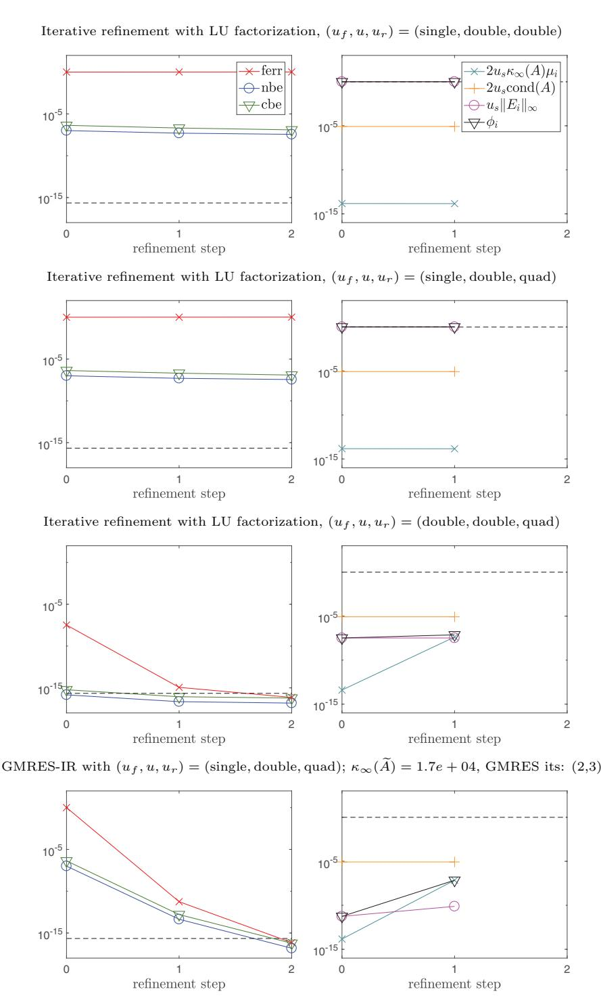  
FIG. 10.1. Comparison of iterative refinement with $L U$ factorization and GMRES-IR for solving $A x = b$ using various precisions. The matrix is generated using gallery('randsvd',100,1e9,2). For this problem, $\kappa _ { 2 } ( A ) = 1 { \mathrm { e } } + 0 9$ , $\kappa _ { \infty } ( A ) = 2 . 0 \mathrm { e } + 1 0$ , a cond $\operatorname { l } ( A , x ) = 5 . 2 \mathrm { { e } } + 0 9$ . (Color available online.)

We now investigate the behavior of both iterative refinement with LU factorization and GMRES-IR (Algorithms 1.1 and 8.1, respectively) in more detail.

10.1. Iterative refinement with LU factorization. We begin by testing iterative refinement (Algorithm 1.1) with LU factorization as the solver, first with two precisions and then three precisions. For each test in this section we list $\kappa _ { 2 } ( A )$ (which we specify as kappa when generating the randsvd matrix), $\kappa _ { \infty } ( A )$ , and $\operatorname { c o n d } ( A , x )$ above the corresponding plots.

10.1.1. Iterative refinement in two precisions. When $u _ { r } ~ = ~ u$ and $u _ { f } =$ $u ^ { 1 / 2 }$ , so that LU factorization is done at half the working precision, we expect backward errors to converge to level $u$ and forward errors to converge to level cond $( A , x ) u$ for matrices with condition number up to $1 / u _ { f }$ ; see Table 7.1.

Results with $( u _ { f } , u , u _ { r } ) =$ (single, double, double) are shown in Figure 10.2 for a matrix with condition number well within the limit of $1 / u _ { f }$ (top row) and a matrix that is extremely ill conditioned with respect to $\boldsymbol { u } _ { f }$ (bottom row). The observed behavior is consistent with the theory: the forward and backward errors all converge to the expected levels (note the effect of the $\operatorname { c o n d } ( A , x )$ term in the forward error limit). In the second test (bottom row), we see that $\kappa _ { \infty } ( A )$ for the generated matrix is already close to $1 / u _ { f }$ . This causes the convergence factor $\phi _ { i }$ to be close to 1, and thus many refinement steps are required for convergence. Note from the plots on the right that $\phi _ { i }$ is dominated by the $u _ { s } \| E _ { i } \| _ { \infty }$ terms.

10.1.2. Iterative refinement in three precisions. We now demonstrate the potential benefits of iterative refinement in three precisions. In Figure 10.3 we take $( u _ { f } , u , u _ { r } ) = ( { \mathrm { s i n g l e } } , { \mathrm { d o u b l e } } , { \mathrm { q u a d } } )$ and use the same matrices as in Figure 10.2. Comparing Figure 10.3 with Figure 10.2 shows the benefit of computing the residuals at twice the working precision: the forward error converges to level $u$ in both cases, without any dependence on $\operatorname { c o n d } ( A , x )$ . Also note that the use of extra precision in the residual computation has no effect on the rate of convergence (compare the values of $\phi _ { i }$ in the right-hand plots).

10.2. GMRES-based iterative refinement. We now test GMRES-IR (Algorithm 8.1) with the combinations of precisions described in Table 8.1. For these tests, within the GMRES method we use the convergence criterion that the relative residual in the 2-norm is no greater than $1 0 ^ { - 2 }$ , $1 0 ^ { - 4 }$ , and $1 0 ^ { - 6 }$ when $u$ is half precision, single precision, and double precision, respectively. Above the plots for each test, we give $\kappa _ { 2 } ( A )$ , $\kappa _ { \infty } ( A )$ , $\operatorname { c o n d } ( A , x )$ , and $\kappa _ { \infty } ( \widetilde { A } ) = \kappa _ { \infty } ( \widehat { U } ^ { - 1 } \widehat { L } ^ { - 1 } A )$ .

10.2.1. GMRES-IR in two precisions. We first test GMRES-IR when two different precisions are used: $u _ { f } = u$ and $u _ { r } = u ^ { 2 }$ . This is the special case that was investigated in [9]. Here we expect convergence of the forward and backward errors to level $u$ for matrices with $\kappa _ { \infty } ( A )$ up to $1 / u$ ; see Table 8.1.

In Figure 10.4, we use $( u _ { f } , u , u _ { r } ) \ : = \ : ( \mathrm { h a l f , h a l f , s i n g l e } )$ , and in Figure 10.5 we use $( u _ { f } , u , u _ { r } ) = ( \mathrm { s i n g l e , s i n g l e , d o u b l e } )$ . For each combination of precisions, we show results for a matrix with condition number well within the $1 / u$ limit (top row) and a matrix that is on the edge of numerical singularity, i.e., $\kappa _ { \infty } ( A ) \gtrsim 1 / u$ (bottom row). For the reasonably well conditioned matrices, the results are as expected. For the case where $\kappa _ { \infty } ( A ) \gtrsim 1 / u$ , the results are better than expected. Despite $A$ being extremely ill conditioned, GMRES-IR succeeds in obtaining backward and forward errors on the level $u$ , and does so requiring very few GMRES iterations in each refinement step. Notice that with $u _ { f } = u$ , $\kappa _ { \infty } ( \widetilde { A } )$ can be substantially less than $\kappa _ { \infty } ( A )$ even when $\kappa _ { \infty } ( A )$ is of the order of $1 / u$ ; see, e.g., the bottom row in Figure 10.5.

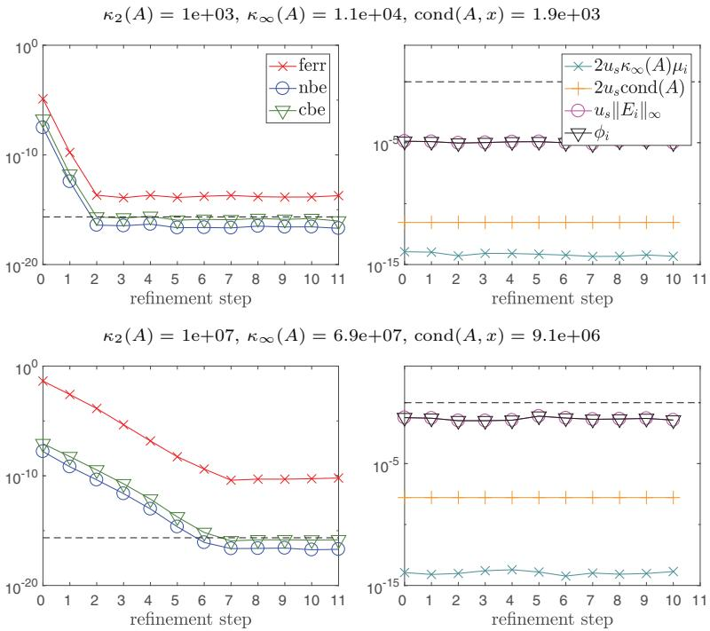  
FIG. 10.2. Iterative refinement with $L U$ factorization using $( u _ { f } , u , u _ { r } ) = ( { \mathrm { s i n g l e , d o u b l e , d o u b l e } } )$

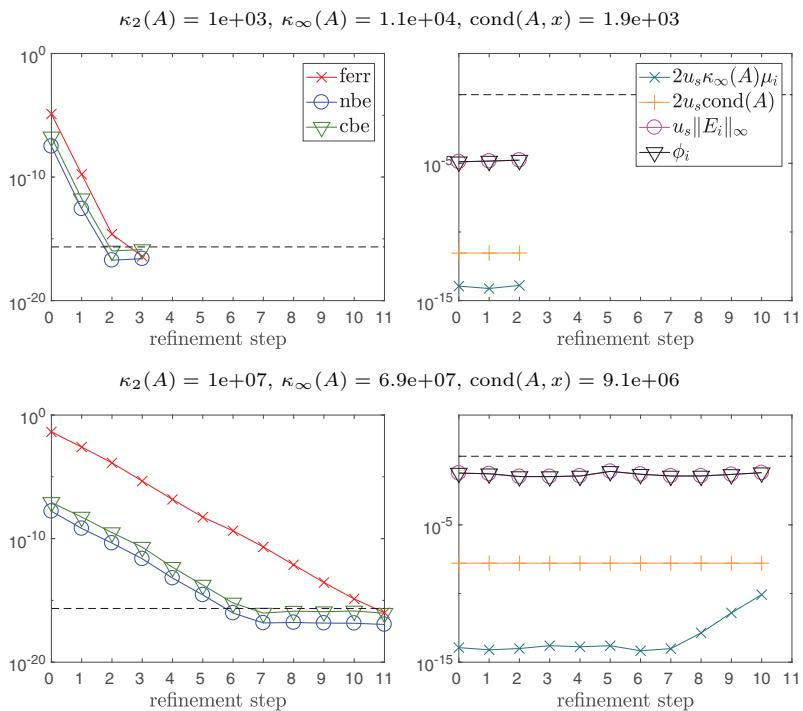  
FIG. 10.3. Iterative refinement with $L U$ factorization using $( u _ { f } , u , u _ { r } ) = ( { \mathrm { s i n g l e , d o u b l e , q u a d } } )$ .

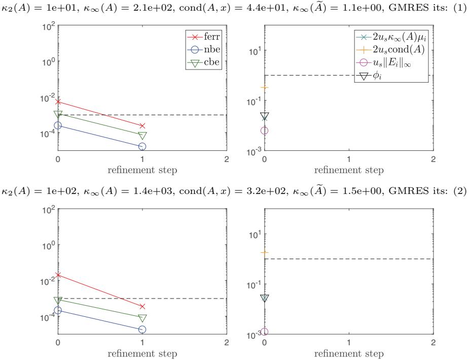  
FIG. 10.4. GMRES-IR using $( u _ { f } , u , u _ { r } ) = ( \mathrm { h a l f } , \mathrm { h a l f } , \mathrm { s i n g l e } )$ .

We note also that the orange pluses in, e.g., Figure 10.5 are at or above 1. That $\phi _ { i }$ is nevertheless substantially less than 1 is thanks to the min function in (3.9) and the ameliorating effect of $\mu _ { i }$ , which was first pointed out in [9].

10.2.2. GMRES-IR in three precisions. We now show the benefit of using three precisions in GMRES-IR, with $u _ { r } < u < u _ { f }$ . According to the theory, the forward and backward errors should converge to level $u$ for matrices with $\kappa _ { \infty } ( A ) \leq$ $1 / u$ . In other words, in GMRES-IR we can compute the LU factorization in precision $u ^ { 1 / 2 }$ and still attain the same bounds on the backward and forward errors as if it were computed in precision $u$ .

Tests with $( u _ { f } , u , u _ { r } )$ set to (half, single, double) and (single, double, quad) are shown in Figures 10.6 and 10.7, respectively. Again for each set of precisions, we show results for a matrix with condition number well within the $1 / u$ limit (top rows) and for a matrix which is extremely ill conditioned with respect to precision $u$ (bottom rows).

The results here are consistent with the theory: in all cases we have convergence of the backward and forward errors to level $u$ . We note that the use of lower precision $\kappa _ { 2 } ( A ) = 1 \mathrm { e } + 0 6$ $\kappa _ { \infty } ( A ) = 7 . 4 \mathrm { e } + 0 6$ , $\operatorname { c o n d } ( A , x ) = 1 . 0 \mathrm { { e } } + 0 6 $ , $\kappa _ { \infty } ( \widetilde { A } ) = 1 . 1 \mathrm { e } { + } 0 0$ , GMRES its: (2)

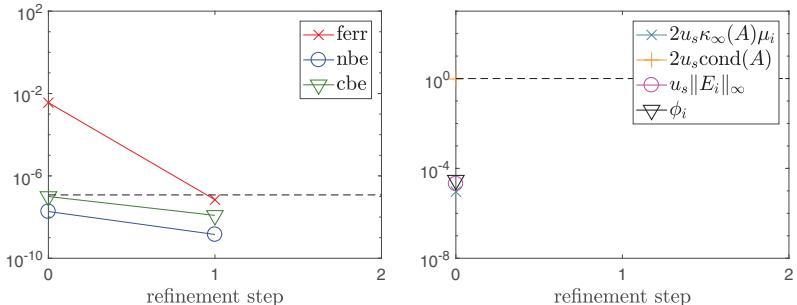

$\kappa _ { 2 } ( A ) = 1 \mathrm { e } + 0 8$ , $\kappa _ { \infty } ( A ) = 6 . 0 \mathrm { e } + 0 8$ $\operatorname { c o n d } ( A , x ) = 8 . 3 \mathrm { { e } } + 0 7$ $\kappa _ { \infty } ( \widetilde { A } ) = 5 . 5 \mathrm { e } + 0 1$ , GMRES its: (6,7)

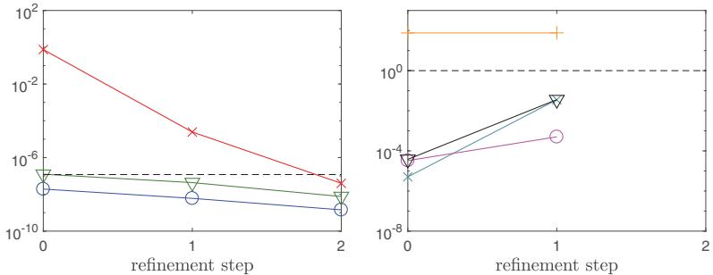  
FIG. 10.5. GMRES-IR using (uf , u, ur) = (single, single, double).

$\kappa _ { 2 } ( A ) = 1 \mathrm { e } { + } 0 1$ , $\kappa _ { \infty } ( A ) = 2 . 1 \mathrm { e } + 0 2$ $\operatorname { c o n d } ( A , x ) = 4 . 4 \mathrm { { e } } + 0 1$ , $\kappa _ { \infty } ( \tilde { A } ) = 1 . 1 \mathrm { e } { + } 0 0$ , GMRES its: (2,2)

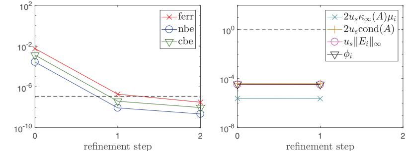  
$\kappa _ { 2 } ( A ) = 1 \mathrm { e } + 0 6$ , $\kappa _ { \infty } ( A ) = 7 . 4 \mathrm { e } + 0 6$ , $\operatorname { c o n d } ( A , x ) = 1 . 0 \mathrm { { e } } + 0 6 $ , $\kappa _ { \infty } ( \tilde { A } ) = 2 . 5 \mathrm { e } { + } 0 4$ , GMRES its: (64,65)

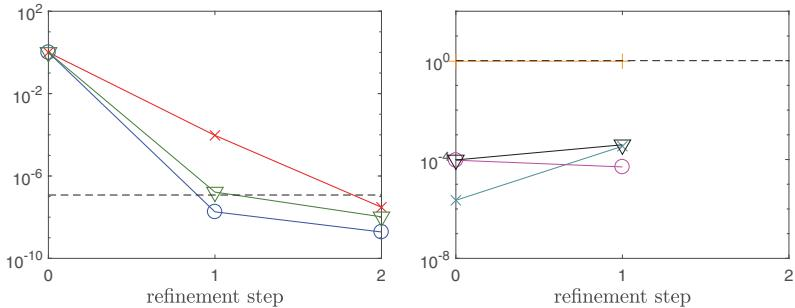  
FIG. 10.6. GMRES-IR using $( u _ { f } , u , u _ { r } ) = ( \mathrm { h a l f , s i n g l e , d o u b l e } ) .$

$\kappa _ { 2 } ( A ) = 1 \mathrm { e } + 0 3$ , $\kappa _ { \infty } ( A ) = 1 . 1 \mathrm { e } { + } 0 4$ $\operatorname { c o n d } ( A , x ) = 1 . 9 \mathrm { { e + } 0 3 }$ . $\kappa _ { \infty } ( \tilde { A } ) = 1 . 0 \mathrm { e } { + } 0 0$ , GMRES its: (2,2)

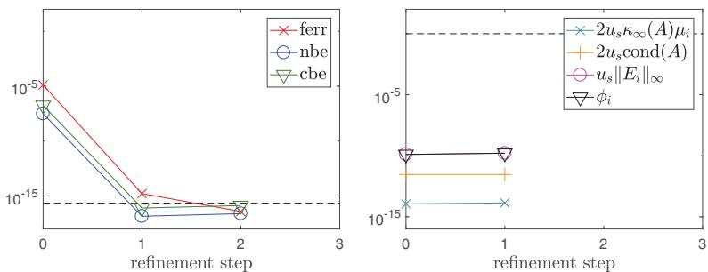  
$\kappa _ { 2 } ( A ) = 1 \mathrm { e } + 1 5$ , $\kappa _ { \infty } ( A ) = 5 . 3 \mathrm { e } + 1 5$ , $\operatorname { c o n d } ( A , x ) = 6 . 3 \mathrm { { e } } + 1 4$ , $\kappa _ { \infty } ( \widetilde { A } ) = 1 . 4 \mathrm { e } { + } 1 0$ , GMRES its: (91,92,92)

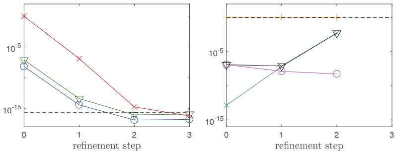  
FIG. 10.7. GMRES-IR using $( u _ { f } , u , u _ { r } ) = ( \mathrm { s i n g l e , d o u b l e , q u a d } ) _ { }$ .

for the LU factorization can work very well for reasonably well conditioned matrices. For example, in the top row of Figure 10.7 where $\kappa _ { \infty } ( A ) = 1 . 1 \mathrm { e }$ +04, only four total GMRES iterations across two refinement steps are required to obtain the desired forward and backward errors. We note that standard iterative refinement with LU factorization also performs well on this problem (see Figure 10.3).

It is important to point out that the number of GMRES iterations in each refinement step increases significantly with $\kappa _ { \infty } ( A )$ for this class of problems. In the bottom row in Figure 10.7, where $A$ is extremely ill conditioned with respect to $u$ , nearly $n$ GMRES iterations are required for each solve. Since $\widetilde { A }$ is applied in precision $u _ { r }$ in each GMRES iteration, this will not be efficient compared with simply computing the LU factorization more accurately.

To show that this approach can indeed still be efficient for some problems, we now run analogous experiments for problems generated using randsvd mode 2, which generates matrices having only one small singular value. The results are shown in Figures 10.8 and 10.9 for GMRES-IR with $( u _ { f } , u , u _ { r } )$ set to (half, single, double) and (single, double, quad), respectively. For mode 2 matrices, the number of GMRES iterations per refinement step grows more modestly with $\kappa _ { \infty } ( A )$ . For example, in the bottom row of Figure 10.9, convergence requires only 7 total GMRES iterations even though $\kappa _ { \infty } ( A ) > 1 / u$ . Also note here that $\kappa _ { \infty } ( \tilde { A } )$ is still very large compared with $\kappa _ { \infty } ( A )$ , which emphasizes the fact that the GMRES convergence rate cannot be connected with the condition number of the preconditioned matrix.

Finally, we consider the more extreme case of GMRES-IR using precisions $( u _ { f }$ $u , \ u _ { r } ) = ( \mathrm { h a l f } , \mathrm { d o u b l e } , \mathrm { q u a d } )$ . The analysis summarized in Table 8.1 predicts that the forward and backward errors should converge to level $u \approx 1 0 ^ { - 1 6 }$ for matrices $\kappa _ { 2 } ( A ) = 1 \mathrm { e } { + } 0 1$ , $\kappa _ { \infty } ( A ) = 2 . 1 \mathrm { e } + 0 2$ , $\operatorname { c o n d } ( A , x ) = 5 . 5 \mathrm { e } + 0 1 .$ . $\kappa _ { \infty } ( \tilde { A } ) = 1 . 2 \mathrm { e } { + } 0 0$ , GMRES its: (2)

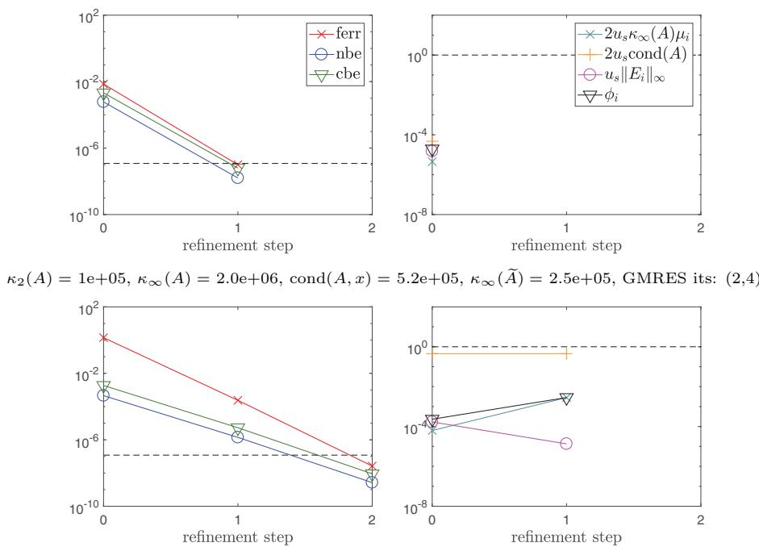  
FIG. 10.8. GMRES-IR using $( u _ { f } , u , u _ { r } ) =$ (half,single,double). The matrices are generated sing randsvd mode 2 (cf. Figure 10.6, which uses mode 3).

$\kappa _ { 2 } ( A ) = 1 { \mathrm { e } } + 0 3 { \mathrm { . } }$ . $\kappa _ { \infty } ( A ) = 2 . 0 \mathrm { e } + 0 4$ , $\operatorname { c o n d } ( A , x ) = 5 . 2 \mathrm { { e } + 0 3 }$ , $\kappa _ { \infty } ( \tilde { A } ) = 1 . 0 \mathrm { e } { + } 0 0$ , GMRES its: (1,2)

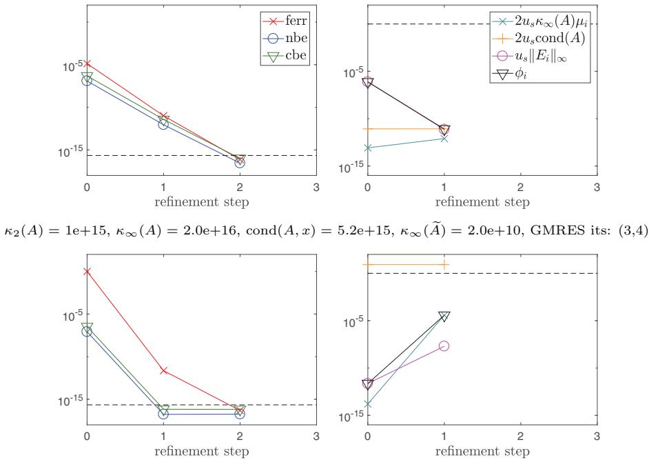  
FIG. 10.9. GMRES-IR using $( u _ { f } , u , u _ { r } ) =$ (single, double, quad). The matrices are generated using randsvd mode 2 (cf. Figure 10.7, which uses mode 3).

$\kappa _ { 2 } ( A ) = 1 \mathrm { e } { + } 0 1$ , $\kappa _ { \infty } ( A ) = 2 . 1 \mathrm { e } + 0 2$ $\operatorname { c o n d } ( A , x ) = 4 . 4 \mathrm { { e } } + 0 1$ $\kappa _ { \infty } ( \tilde { A } ) = 1 . 1 \mathrm { e } { + } 0 0$ , GMRES its: (3,3)

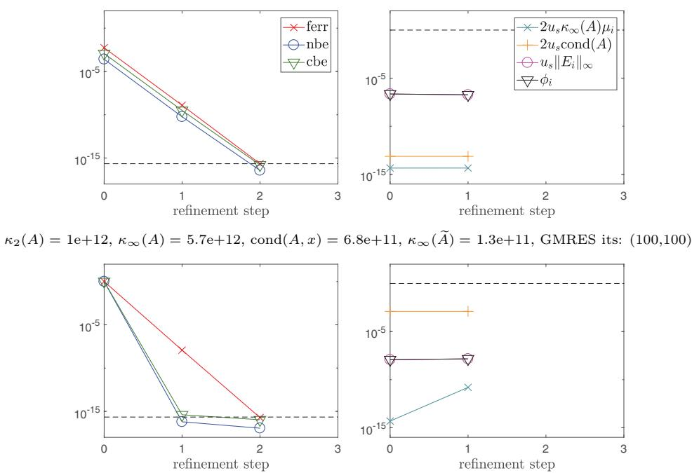  
FIG. 10.10. GMRES-IR using $( u _ { f } , u , u _ { r } ) = ( \mathrm { h a l f } , \mathrm { d o u b l e } , \mathrm { q u a d } )$ . The matrices are generated sing randsvd mode 3.

with $\kappa _ { \infty } ( A )$ up to $1 0 ^ { 1 2 }$ . In other words, in GMRES-IR we can compute the LU factorization in a quarter of the working precision without increasing the forward or backward errors.

We show tests for randsvd mode 3 matrices in Figure 10.10 and randsvd mode 2 matrices in Figure 10.11. The story is largely the same as in the case of $( u _ { f } , u , u _ { r } ) =$ (single, double, quad) in Figures 10.7 and 10.9. For randsvd mode 3 matrices, although the errors reach the levels predicted by the theory, each solve may require too many GMRES iterations to be practical unless $A$ is well conditioned (see Figure 10.10). However, Figure 10.11 shows that for randsvd mode 2 matrices the number of GMRES iterations is much more favorable for ill-conditioned $A$ . Note that in the bottom row in Figure 10.10, we encounter overflow in computing the initial solution $x _ { 0 }$ and thus take $x _ { 0 } = 0$ .

10.3. Discussion. The experiments show that the behaviors in practice of Algorithms 1.1 and 8.1 (GMRES-IR) match well the predictions of the analysis, and even exceed it for GMRES-IR. An important difference between the two algorithms is that GMRES-IR converges quickly in all cases (at most three iterations in Figures 10.4- 10.11), whereas Algorithm 1.1 using LU factorization can be much slower. This is related to the fact, visible in the right-hand columns of the plots, that Algorithm 1.1 with LU factorization is "on the edge" as regards the convergence criteria ( $\phi _ { i }$ is close to 1), whereas GMRES-IR satisfies the criteria much more comfortably.

Our experiments confirm that the LU factorization can be computed at less than the working precision while still obtaining backward errors and forward errors at the working precision.

$\kappa _ { 2 } ( A ) = 1 \mathrm { e } { + } 0 1$ , $\kappa _ { \infty } ( A ) = 2 . 1 \mathrm { e } + 0 2$ $\operatorname { c o n d } ( A , x ) = 5 . 5 \mathrm { e } + 0 1$ $\kappa _ { \infty } ( \tilde { A } ) = 1 . 2 \mathrm { e } { + } 0 0$ , GMRES its: (3,3)

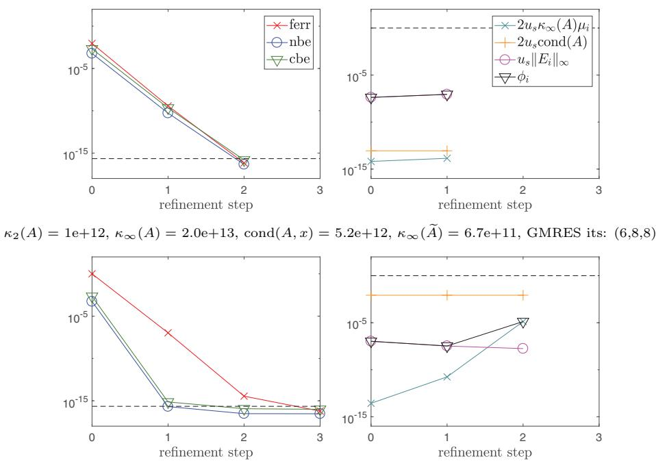  
FIG. 10.11. GMRES-IR using $( u _ { f } , u , u _ { r } ) = ( \mathrm { h a l f } , \mathrm { d o u b l e } , \mathrm { q u a d } )$ . The matrices are generated 'sing randsvd mode 2.

The overall efficiency of GMRES-IR depends on the number of GMRES iterations required. Using less than working precision in the LU factorization can in some cases diminish the effectiveness of $\widehat { L } \widehat { U }$ as a preconditioner in GMRES-IR, resulting in an undesirably high number of GMRES iterations. This can in turn reduce or outweigh any potential computational savings from computing a lower precision LU factorization.

For ease of comparison between approaches, our experiments use a consistent GMRES tolerance based on the working precision ( $1 0 ^ { - 2 }$ for half, $1 0 ^ { - 4 }$ for single, and $1 0 ^ { - 6 }$ for double). In practice, however, the GMRES tolerance could be adjusted to minimize the total number of GMRES iterations performed across refinement steps. The analysis in [9, sect. 3] shows that the smaller $\kappa _ { \infty } ( \tilde { A } )$ , the larger we can set the GMRES convergence tolerance while still meeting the constraint (2.3); of course, if the tolerance parameter is made too large, this can increase the number of refinement steps required for convergence.

Of course, whether changing the GMRES tolerance will result in fewer GMRES iterations depends on the convergence trajectory of GMRES, which in turn depends heavily on properties of the linear system. For nonnormal matrices, $\kappa _ { \infty } ( \tilde { A } )$ and even the full spectrum of $\widetilde { A }$ have no direct connection to the GMRES convergence rate, so we cannot draw any theoretical conclusions.

For normal $A$ , however, we can connect spectral properties of $\widetilde { A }$ with the convergence rate of GMRES. Although further investigation is out of the scope of this work, we briefly mention some potential approaches for improving GMRES-IR performance in cases where the coefficient matrix is normal and GMRES convergence for the resulting preconditioned matrix $\widetilde { A }$ constructed using lower precision LU factors is slow. One possibility is to add an additional preconditioner in order to eliminate eigenvalues or clusters of eigenvalues that cause difficulties for GMRES. One could also incorporate a deflation-based technique to eliminate these parts of the spectrum.

Another approach (for any $A$ ) is to try a different Krylov subspace iterative method. One possibility is the flexible GMRES method, which was proved to be backward stable by Arioli and Duff [6]. In practice, however, we need not limit ourselves to methods known to be backward stable; though they may not provide the same guarantees on backward stability, such methods may provide a faster convergence rate for some problems. Since the GMRES-IR method solves a sequence of linear systems, each with the same coefficient matrix $A$ , the use of recycled Krylov subspace methods [32] to reduce the total number of GMRES iterations is worthy of further investigation.

11. Conclusions. This work makes two main contributions to the solution of $A x \ = \ b$ . The first contribution is to show that by using three precisions instead of two in iterative refinement, it is possible to accelerate the solution process and to obtain more accurate results for a wider class of problems. To be concrete, let the working precision in which $A$ , $b$ , and the iterates $x _ { i }$ are stored be IEEE single precision and consider the following four forms of iterative refinement, all employing LU factorization.

•Method 1 (traditional): factorize $A$ at single precision, compute residuals at double precision. Method 2 (Langou et al. [24], with single and double precision therein replaced by half and single precision, respectively): factorize $A$ at half precision, compute residuals at single precision.   
Algorithm 1.1: factorize $A$ at half precision, compute residuals at double precision.   
Algorithm 8.1 (GMRES-IR): factorize $A$ at half precision, compute residuals at double precision, compute updates using preconditioned GMRES.

Method 1 is guaranteed to provide forward and backward errors of order $u \approx$ $1 0 ^ { - 8 }$ as long as $\kappa _ { \infty } ( A ) < 1 0 ^ { 8 }$ . Method 2 is potentially up to twice as fast, since it factorizes at half precision, but it requires $\kappa _ { \infty } ( A ) < 1 0 ^ { 4 }$ to guarantee convergence and it delivers a forward error of order $\operatorname { c o n d } ( A , x ) u$ . Algorithm 1.1 improves on Method 2 by delivering a forward error of order $u$ under the same assumption on $\kappa _ { \infty } ( A )$ . GMRES-IR provides a further improvement because it requires only $\kappa _ { \infty } ( A ) <$ $1 0 ^ { 8 }$ for convergence, like Method 1. Moreover, it is likely to converge faster than Method 2 and Algorithm 1.1.

The overall speed of GMRES-IR in three precisions depends on the number of GMRES iterations, which is hard to predict and can be large. However, we have shown experimentally that for some problems GMRES can converge in a small number of iterations. (When GMRES-IR is used with just two precisions, as originally proposed in [9], fast convergence of GMRES is always observed in our experience.)

Further work is needed to tune the GMRES convergence tolerance, to investigate alternative GMRES preconditioning strategies, and to investigate the speed of the algorithms in computing environments where half, single, and double precisions are supported in hardware. A first step in this direction is the recent performance study of Haidar et al. [16], which shows promising results.

Our results can be viewed in a different way by comparison with a standard $A x = b$ solver based on LU factorization in precision $u$ . By using Algorithm 1.1 or GMRES-IR with $u _ { f } = u ^ { 1 / 2 }$ we can solve the system more accurately and up to twice as fast, the speed advantage arising because the $O ( n ^ { 3 } )$ part of the work is potentially all done at lower precision.

The second contribution of this work is to give general backward error and forward error analyses of iterative refinement that include almost all previous ones as special cases and improve upon some existing results. Crucially, the analyses include four precisions as parameters, which is necessary in order for them to apply to GMRES-IR. Our numerical experiments confirm the predictions of the theory regarding conditions for convergence and the limiting backward and forward errors of Algorithms 1.1 and 8.1. The analyses should be useful for understanding further algorithmic variants that may be proposed, for example, ones based on approximate LU factors (such as those from incomplete factorizations) or on different iterative solvers.

Our MATLAB codes are available at https://github.com/eccarson/ir3.

# REFERENCES

[1] A. AbDELFATTAH, H. AnzT, J. DONgARRA, M. GaTES, A. HaiDAR, J. KUrZAK, P. LUSZCzEK, S. ToMOv, I. YAMAZAKI, AND A. YARKHAN, Linear algebra software for large-scale accelerated multicore computing, Acta Numer., 25 (2016), pp. 1160, https://doi.org/10.1017/ S0962492916000015.   
[2] E. AgULLO, J. DEMMEL, J. DONgARRA, B. HADRI, J. KUrZAK, J. LANgOU, H. LtAiEF, P. LuszczEK, AND S. ToMov, Numerical linear algebra on emerging architectures: The PLASMA and MAGMA projects, J. Phys. Conf. Ser., 180 (2009), 012037, https://doi.org/ 10.1088/1742-6596/180/1/012037.   
[3] E. AnDERsoN, Robust Triangular Solves for Use in Condition Estimation, LAPACK Working Note 36, Technical Report CS-91-142, Department of Computer Science, University of Tennessee, Knoxvile, TN, 1991, http://www.netlib.org/lapack/lawnspdf/lawn36.pdf.   
[4] E. ANDERSON, Z. BAI, C. H. BIsCHOF, S. BLACKFORD, J. W. DEMMEL, J. J. DONGARRA, J. J. Du CRoz, A. GrEENBAUM, S. J. HaMMaRLInG, A. McKENNEy, ANd D. C. SOrEnsEn, LAPACK Users' Guide, 3rd ed., SIAM, Philadelphia, 1999, http://www.netlib.org/lapack/ lug/.   
[5] M. ARIOLI, J. W. DEMMEL, AND I. S. DUFF, Solving sparse linear systems with sparse backward error, SIAM J. Matrix Anal. Appl., 10 (1989), pp. 165190, https://doi.org/10.1137/ 0610013.   
[6] M. ARIOLI AND I. S. DUFF, Using FGMRES to obtain backward stability in mixed precision, Electron. Trans. Numer. Anal., 33 (2009), pp. 3144, https://eudml.org/doc/130614.   
[7] M. ARIOLI, I. S. DUFF, S. GRATTON, AND S. PRALET, A note on GMRES preconditioned by a perturbed $L D L ^ { T }$ decomposition with static pivoting, SIAM J. Sci. Comput., 29 (2007), pp. 20242044, https://doi.org/10.1137/060661545.   
[8] M. ARIOLI AND J. ScoTT, Chebyshev acceleration of iterative refinement, Numer. Algorithms, 66 (2014), pp. 591608, https://doi.org/10.1007/s11075-013-9750-7.   
[9] E. CARSoN AND N. J. HiGHAM, A new analysis of iterative refinement and its application to accurate solution of ill-conditioned sparse linear systems, SIAM J. Sci. Comput., 39 (2017), pp. A2834A2856, https://doi.org/10.1137/17M1122918.   
[10] J. W. DEMMEL AND X. LI, Faster numerical algorithms via exception handling, IEEE Trans. Comput., 43 (1994), pp. 983992, https://doi.org/10.1109/12.295860.   
[11] C. C. DoUGLAS, J. MANDEL, AND W. L. MIRANKER, Fast hybrid solution of algebraic systems, SIAM J. Sci. Statist. Comput., 11 (1990), pp. 10731086, https://doi.org/10.1137/0911060.   
[12] L. Fox, H. D. HusKEY, AND J. H. WILKINsoN, Notes on the solution of algebraic linear simultaneous equations, Quart. J. Mech. Appl. Math., 1 (1948), pp. 149173, https: //doi.org/10.1093/qjmam/1.1.149.   
[13] L. FOX, H. D. HusKEY, AND J. H. WILKINSON, The Solution of Algebraic Linear Simultaneous Equations by Punched Card Methods, Report, Mathematics Division, Department of Scientific and Industrial Research, National Physical Laboratory, Teddington, UK, 1948. This note was intended to be included as" section 5 of [12], "but was finally omitted for reasons of economy of space."   
[14] P. E. GILL, M. A. SAUNDERS, AND J. R. SHINNERL, On the stability of Cholesky factorization for symmetric quasidefinite systems, SIAM J. Matrix Anal. Appl., 17 (1996), pp. 3546, https://doi.org/10.1137/S0895479893252623.   
[ A. G, . , A .     C for GMRES, SIAM J. Matrix Anal. Appl., 17 (1996), pp. 465469, https://doi.org/10. 1137/S0895479894275030.   
[16] A. HAIDAR, P. WU, S. ToMOV, AND J. DONGARRA, Investigating half precision arithmetic to accelerate dense linear system solvers, in Proceedings of the 8th Workshop on Latest Advances in Scalable Algorithms for Large-Scale Systems, ScalA '17, 2017, pp. 10:110:8, https://doi.org/10.1145/3148226.3148237.   
[17] N. J. HigHAM, Iterative refinement enhances the stability of QR factorization methods for solving linear equations, BIT, 31 (1991), pp. 447468, https://doi.org/10.1007/BF01933262.   
[18] N. J. HigHAM, Iterative refinement for linear systems and LAPACK, IMA J. Numer. Anal., 17 (1997), pp. 495509, https://doi.org/10.1093/imanum/17.4.495.   
[19] N. J. HiGHAM, Accuracy and Stability of Numerical Algorithms, 2nd ed., SIAM, Philadelphia, PA, 2002, https://doi.org/10.1137/1.9780898718027.   
[20] J. D. HoGG AND J. A. ScOTT, A fast and robust mixed-precision solver for the solution of sparse symmetric linear systems, ACM Trans. Math. Software, 37 (2010), pp. 17:117:24, https://doi.org/10.1145/1731022.1731027.   
[21] IEEE Standard for Floating-Point Arithmetic, IEEE Std 754-2008 (revision of IEEE Std 754- 1985), IEEE Computer Society, New York, 2008, https://doi.org/10.1109/IEEESTD.2008. 4610935.   
[22] M. JANKowsKI AND H. WoNIAKowSKI, Iterative refinement implies numerical stability, BIT, 17 (1977), pp. 303311, https://doi.org/10.1007/BF01932150.   
[23] A. KBAss, Itrative reinement for linear sstemsin variable-preisin arithmeic, BIT, 21 (1981), pp. 97103, https://doi.org/10.1007/BF01934074.   
[24] J. LANGOU, J. LANGOU, P. LUSZCZEK, J. KURZAK, A. BUTTARI, AND J. DONGARRA, Exploiting the performance of 32 bit floating point arithmetic in obtaining 64 bit accuracy (revisiting iterative refinement for linear systems), in Proceedings of the 2006 ACM/IEEE Conference on Supercomputing, 2006, https://doi.org/10.1109/SC.2006.30.   
[25] J. LIESEN AND P. TICHY, The worst-case GMRES for normal matrices, BIT, 44 (2004), pp. 79 98, https://doi.org/10.1023/B:BITN.0000025083.59864.bd.   
[26] C. B. MoLER, Cleve Laboratory, available onine from http://uk.mathworks.com/ matlabcentral/fileexchange/59085-cleve-laborator.   
[27] C. B. MoLER, Iterative refinement in floating point, J. Assoc. Comput. Mach., 14 (1967), pp. 316321, https://doi.org/10.1145/321386.321394.   
[28] C. B. MoLER, "Half Precision" 16-Bit Floating Point Arithmetic, http:/blogs.mathworks. com/cleve/2017/05/08/half-precision-16-bit-floating-point-arithmetic/, 2017.   
[29] Multiprecision Computing Toolbox. Advanpix, Tokyo, http://www.advanpix.com.   
[30] W. OETTLI AND W. PRAGER, Compatibility of approximate solution of linear equations with given error bounds for cofficients and right-hand sides, Numer. Math., 6 (1964), pp. 405 409, https://doi.org/10.1007/BF01386090.   
[31] C. C. PAIGE, M. ROZLONíK, AND Z. STRAKoS, Modified GramSchmidt (MGS), least squares, and backward stability of MGS-GMRES, SIAM J. Matrix Anal. Appl., 28 (2006), pp. 264 284, https://doi.org/10.1137/050630416.   
[32] M. L. PARKS, E. DE STURLER, G. MACKEY, D. D. JoHNSON, AND S. MAITI, Recycling Krylov subspaces for sequences of linear systems, SIAM J. Sci. Comput., 28 (2006), pp. 16511674, https://doi.org/10.1137/040607277.   
[33] J. L. RIGAL AND J. GACHEs, On the compatibility of a given solution with the data of a linear system, J. Assoc. Comput. Mach., 14 (1967), pp. 543548, https://doi.org/10.1145/321406. 321416.   
[34] R. D. SkEEL, Iterative refinement implies numerical stability for Gaussian elimination, Math. Comp., 35 (1980), pp. 817832, https://doi.org/10.1090/S0025-5718-1980-0572859-4.   
[35] A. SMOKTUNowICZ AND J. SoKoLNICKA, Binary cascades iterative refinement in doubledmantissa arithmetics, BIT, 24 (1984), pp. 123127, https://doi.org/10.1007/BF01934524.   
[36] G. W. STEwART, Introduction to Matrix Computations, Academic Press, New York, 1973.   
[37] F. TissEuR, Newton's method in floating point arithmetic and iterative refinement of generalized eigenvalue problems, SIAM J. Matrix Anal. Appl., 22 (2001), pp. 10381057, https://doi. org/10.1137/S0895479899359837.   
[38] J. H. WILKINsoN, Progress Report on the Automatic Computing Engine, Report MA/17/1024, Mathematics Division, Department of Scientific and Industrial Research, National Physical Laboratory, Teddington, UK, 1948, http://www.alanturing.net/turing_archive/archive/l/ 110/110.php.   
[39] J. H. WILKINsoN, Rounding Errors in Algebraic Processes, Notes Appl. Sci. 32, Her Majesty's Stationery Office, London, 1963; also published by Prentice-Hall, Englewood Cliffs, NJ, reprinted by Dover, New York, 1994.   
[40] J. H. WILKINsoN, Modern error analysis, SIAM Rev., 13 (1971), pp. 548568, https://doi.org/ 10.1137/1013095.   
[41] Z. ZLATEV, Use of iterative refinement in the solution of sparse linear systems, SIAM J. Numer. Anal., 19 (1982), pp. 381399, https://doi.org/10.1137/0719024.