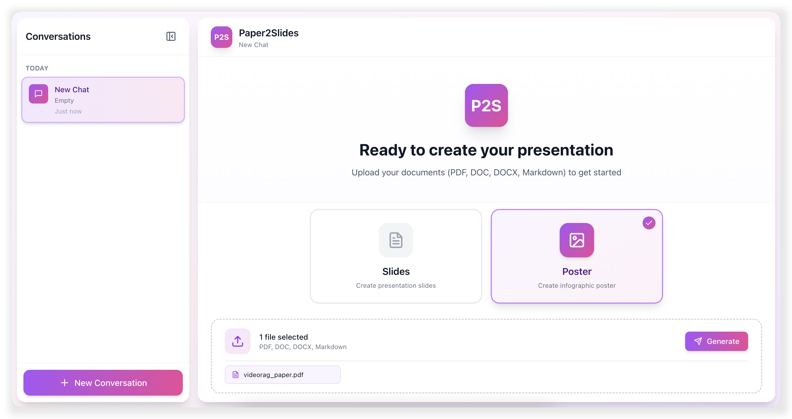
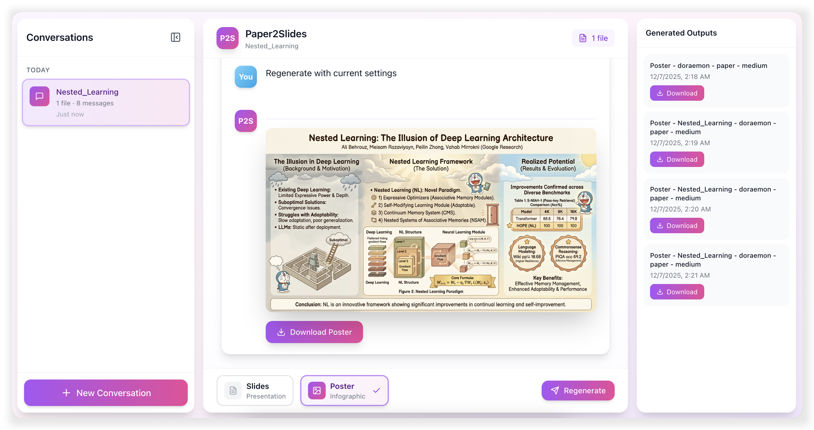

<div align="center">

<br>

# Paper2Slides: From Paper to Presentation in One Click

[](https://www.python.org/)
[](https://opensource.org/licenses/MIT/)
[](./COMMUNICATION.md) 
[](./COMMUNICATION.md)

✨ **Never Build Slides from Scratch Again** ✨

| 📄 **Universal File Support** &nbsp;|&nbsp; 🎯 **RAG-Powered Precision** &nbsp;|&nbsp; 🎨 **Custom Styling** &nbsp;|&nbsp; ⚡ **Lightning Speed** |

</div>

---

## 🎯 What is Paper2Slides?

Turns your **research papers**, **reports**, and **documents** into **professional slides & posters** in **minutes**.

### ✨ Key Features
- 📄 **Universal Document Support**<br>
  Seamlessly process PDF, Word, Excel, PowerPoint, Markdown, and multiple file formats simultaneously.
  
- 🎯 **Comprehensive Content Extraction**<br>
  RAG-powered mechanism ensures every critical insight, figure, and data point is captured with precision.
  
- 🔗 **Source-Linked Accuracy**<br>
  Maintains direct traceability between generated content and original sources, eliminating information drift.
  
- 🎨 **Custom Styling Freedom**<br>
  Choose from professional built-in themes or describe your vision in natural language for custom styling.
  
- ⚡ **Lightning-Fast Generation**<br>
  Instant preview mode enables rapid experimentation and real-time refinements.
  
- 💾 **Seamless Session Management**<br>
  Advanced checkpoint system preserves all progress—pause, resume, or switch themes instantly without loss.
  
- ✨ **Professional-Grade Visuals**<br>
  Deliver polished, presentation-ready slides and posters with publication-quality design standards.

### ⚡ Easy as One Command
```bash
# One command to generate slides from a paper
python -m paper2slides --input paper.pdf --output slides --style doraemon --length medium --fast --parallel 2
```

---

## 🔥 News

- **[2025.12.09]** Added parallel slide generation (`--parallel`) for faster processing
- **[2025.12.08]** Paper2Slides is now open source!

---

## 🎨 Custom Styling Showcase

<div align="center">

<table>
<tr>
<td align="center" width="290"><br/><code>doraemon</code></td>
<td align="center" width="290"><br/><code>academic</code></td>
<td align="center" width="290"><br/><code>custom</code></td>
</tr>
</table>

<table>
<tr>
<td align="center" width="290"><a href="assets/doraemon_slides.pdf"></a><br/><code>doraemon</code></td>
<td align="center" width="290"><a href="assets/academic_slides.pdf"></a><br/><code>academic</code></td>
<td align="center" width="290"><a href="assets/totoro_slides.pdf"></a><br/><code>custom</code></td>
</tr>
</table>

<sub>✨ Multiple styles available — simply modify the <code>--style</code> parameter<br/>
Examples from <a href="https://arxiv.org/abs/2512.02556">DeepSeek-V3.2: Pushing the Frontier of Open Large Language Models</a></sub>

</div>

<details>
<summary><b>💡 Custom Style Example: Totoro Theme</b></summary>

```
--style "Studio Ghibli anime style with warm whimsical aesthetic. Use soft watercolor Morandi tones with light cream background, muted sage green and dusty pink accents. Totoro character can appear as a friendly guide relating to the content, with nature elements like soft clouds or leaves."
```

</details>

---

### 🌐 Paper2Slides Web Interface

<div align="center">
<table>
<tr>
<td></td>
<td></td>
</tr>
</table>
</div>

---

## 📋 Table of Contents

- [🎯 Quick Start](#-quick-start)
- [🏗️ Paper2Slides Framework](#%EF%B8%8F-paper2slides-framework)
- [🔧 Configuration](#%EF%B8%8F-configuration)
- [📁 Code Structure](#-code-structure)

---

## 🏃 Quick Start

### 1. Environment Setup

```bash
# Clone repository
git clone https://github.com/HKUDS/Paper2Slides.git
cd Paper2Slides

# Create and activate conda environment
conda create -n paper2slides python=3.12 -y
conda activate paper2slides

# Install dependencies
pip install -r requirements.txt
```

> [!NOTE]
> Create a `.env` file in `paper2slides/` directory with your API keys. Refer to `paper2slides/.env.example` for the required variables.

### 2. Command Line Usage

```bash
# Basic usage - generate slides from a paper
python -m paper2slides --input paper.pdf --output slides --length medium

# Generate poster with custom style
python -m paper2slides --input paper.pdf --output poster --style "minimalist with blue theme" --density medium

# Fast mode
python -m paper2slides --input paper.pdf --output slides --fast

# Enable parallel generation (2 workers by default)
python -m paper2slides --input paper.pdf --output slides --parallel 2

# List all processed outputs
python -m paper2slides --list
```

For `--output slides`, the Phase 1 PPTX path now writes:

- `checkpoint_slide_spec.json`
- `<timestamp>/slides.pptx`

Slides are generated with a LangGraph/LangChain text-model workflow. The
pipeline does not call the image-generation provider for `--output slides`;
instead, a deck-curation LLM node condenses the verbose paper plan into concise
slide titles, takeaways, bullets, source-figure placements, and native tables.
Source figures are reused from the parsed paper images and inserted into the
editable PPTX.

For `--output poster`, the existing image-generation output path is unchanged.

**CLI Options**:

| Option | Description | Default |
|--------|-------------|---------|
| `--input, -i` | Input file(s) or directory | Required |
| `--output` | Output type: `slides` or `poster` | `poster` |
| `--content` | Content type: `paper` or `general` | `paper` |
| `--style` | Style: `academic`, `doraemon`, or custom | `doraemon` |
| `--length` | Slides length: `short`, `medium`, `long` | `short` |
| `--density` | Poster density: `sparse`, `medium`, `dense` | `medium` |
| `--fast` | Fast mode: skip RAG indexing | `false` |
| `--parallel` | Enable parallel slide generation: `--parallel` uses 2 workers, `--parallel N` uses N workers | `1` (sequential without this option) |
| `--from-stage` | Force restart from stage: `rag`, `summary`, `plan`, `generate` | Auto-detect |
| `--debug` | Enable debug logging | `false` |

**💾 Checkpoint & Resume**:

Paper2Slides intelligently saves your progress at every key stage, allowing you to:

| Scenario | Command |
|----------|---------|
| **Resume after interruption** | Just run the same command again — it auto-detects and continues |
| **Change style only** | Add `--from-stage plan` to skip re-parsing |
| **Regenerate images** | Add `--from-stage generate` to keep the same plan |
| **Full restart** | Add `--from-stage rag` to start from scratch |

> [!TIP]
> Checkpoints are auto-saved. Just run the same command to resume. Use `--from-stage` only to **force** restart from a specific stage.

### 3. Web Interface

Launch both backend and frontend services:

```bash
./scripts/start.sh
```

Or start services independently:

```bash
# Terminal 1: Start backend API
./scripts/start_backend.sh

# Terminal 2: Start frontend
./scripts/start_frontend.sh
```

Access the web interface at `http://localhost:5173` (default)

<div align="center">
<table>
<tr>
<td></td>
<td></td>
</tr>
</table>
</div>

---

## 🏗️ Paper2Slides Framework

Paper2Slides transforms documents through a 4-stage pipeline designed for **reliability** and **efficiency**:

| Stage | Description | Checkpoint | Output |
|-------|-------------|------------|------------|
| **🔍 RAG** | Parse documents and construct intelligent retrieval index using RAG | `checkpoint_rag.json` | Searchable knowledge base|
| **📊 Analysis** | Extract document structure, identify key figures, tables, and content hierarchy	| `checkpoint_summary.json` | Structured content map |
| **📋 Planning** | Generate optimized content layout and slide/poster organization strategy | `checkpoint_plan.json` | Presentation blueprint|
| **🎨 Creation** | Render final high-quality slides and poster visuals | Output directory | Polished presentation materials |

### 💾 Smart Recovery System
Each stage automatically saves progress checkpoints, enabling seamless resumption from any point if the process is interrupted—no need to start over.

### Fast Mode vs Normal Mode

| Mode | Processing Pipeline | Use Cases |
|------|---------------------|-----------|
| **Normal** | Complete RAG indexing with deep document analysis | Complex research papers, lengthy documents, multi-section content|
| **Fast** | Skip RAG indexing, direct LLM query | Short documents, instant previews, quick revisions |

Use `--fast` when:
- Document (text + figures) is short enough to fit in LLM context
- Quick preview/iteration needed
- Don't want to wait for RAG indexing

Use normal mode (default) when:
- Document is long or has many figures
- Multiple files to process together
- Need retrieval for better context selection

---

## ⚙️ Configuration

### Output Directory Structure

```
outputs/
├── <project_name>/
│   ├── <content_type>/                   # paper or general
│   │   ├── <mode>/                       # fast or normal
│   │   │   ├── checkpoint_rag.json       # RAG query results & parsed file paths
│   │   │   ├── checkpoint_summary.json   # Extracted content, figures, tables
│   │   │   ├── summary.md                # Human-readable summary
│   │   │   └── <config_name>/            # e.g., slides_doraemon_medium
│   │   │       ├── state.json            # Current pipeline state
│   │   │       ├── checkpoint_plan.json  # Content plan for slides/poster
│   │   │       └── <timestamp>/          # Generated outputs
│   │   │           ├── slide_01.png
│   │   │           ├── slide_02.png
│   │   │           ├── ...
│   │   │           └── slides.pdf        # Final PDF output
│   │   └── rag_output/                   # RAG index storage
│   └── ...
└── ...
```

**Checkpoint Files**:
| File | Description | Reusable When |
|------|-------------|---------------|
| `checkpoint_rag.json` | Parsed document content | Same input files |
| `checkpoint_summary.json` | Figures, tables, structure | Same input files |
| `checkpoint_plan.json` | Content layout plan | Same style & length/density |

### Style Configuration

| Style | Description |
|-------|-------------|
| `academic` | Clean, professional academic presentation style |
| `doraemon` | Colorful, friendly style with illustrations |
| `custom` | Any text description for LLM-generated style |

### Image Generation Providers

`--output slides` does not use these settings. They are only used by the poster
path and by legacy image/PDF slide generation code.

- Set `IMAGE_GEN_PROVIDER` in `paper2slides/.env` to choose the backend:
  - `openrouter` (default): uses `IMAGE_GEN_API_KEY`, `IMAGE_GEN_BASE_URL`, and `IMAGE_GEN_MODEL` (default `google/gemini-3-pro-image-preview`)
  - `google`: uses the official Gemini API at `GOOGLE_GENAI_BASE_URL` (default `https://generativelanguage.googleapis.com/v1beta`), `IMAGE_GEN_API_KEY`, `IMAGE_GEN_MODEL` (default `models/gemini-3-pro-image-preview`, must be image-capable), and `IMAGE_GEN_RESPONSE_MIME_TYPE` (default `text/plain`; use text types if your model does not support image responses)
- Reference figures are sent as inline data when supported (Google) or as `image_url` attachments (OpenRouter).

### Image Generation Notes

> [!TIP]
> By default Paper2Slides uses `gemini-3-pro-image-preview` (OpenRouter) for image generation; you can switch to an image-capable Google Gemini model (e.g., `models/gemini-1.5-flash`) via `IMAGE_GEN_PROVIDER=google`. Key findings:
> 
> - **Mood Keywords**: Words like "warm", "elegant", "vibrant" strongly influence the overall color palette
> - **Layout vs Style**: Fine-grained *layout* instructions ground well; fine-grained *element styling* does not
> - **Prompt Length**: Simple prompts generally outperform detailed ones
> - **Multi-slide Generation**: Native multi-image output is story-like; for consistent slides, we use iterative single-image generation

---

## 📁 Code Structure

| Module | Description |
|--------|-------------|
| `paper2slides/core/` | Pipeline orchestration, 4-stage execution |
| `paper2slides/raganything/` | Document parsing & RAG indexing |
| `paper2slides/summary/` | Content extraction: figures, tables, paper structure |
| `paper2slides/generator/` | Content planning & image generation |
| `api/` | FastAPI backend for web interface |
| `frontend/` | React frontend (Vite + TailwindCSS) |

<details>
<summary><b>Click to expand full project structure</b></summary>

```
Paper2Slides/
├── paper2slides/                 # Core library
│   ├── main.py                   # CLI entry point
│   ├── core/
│   │   ├── pipeline.py           # Main pipeline orchestration
│   │   ├── state.py              # Checkpoint state management
│   │   └── stages/
│   │       ├── rag_stage.py      # Stage 1: Parse & index
│   │       ├── summary_stage.py  # Stage 2: Extract content
│   │       ├── plan_stage.py     # Stage 3: Plan layout
│   │       └── generate_stage.py # Stage 4: Generate images
│   │
│   ├── raganything/
│   │   ├── raganything.py        # RAG processor
│   │   └── parser.py             # Document parser
│   │
│   ├── summary/
│   │   ├── paper.py              # Paper structure extraction
│   │   └── extractors/           # Figure/table extractors
│   │
│   ├── generator/
│   │   ├── content_planner.py    # Slide/poster planning
│   │   └── image_generator.py    # Image generation
│   │
│   ├── prompts/                  # LLM prompt templates
│   └── utils/                    # Utilities
│
├── api/server.py                 # FastAPI backend
├── frontend/src/                 # React frontend
└── scripts/                      # Shell scripts (start/stop)
```

</details>

---

## 🙏 Related Open-Sourced Projects

- **[LightRAG](https://github.com/HKUDS/LightRAG)**: Graph-Empowered RAG
- **[RAG-Anything](https://github.com/HKUDS/RAG-Anything)**: Multi-Modal RAG
- **[VideoRAG](https://github.com/HKUDS/VideoRAG)**: RAG with Extremely-Long Videos

---

<div align="center">

**🌟Found Paper2Slides helpful? Star us on GitHub!**

**🚀 Turn any document into professional presentations in minutes!**  

</div>

---

## Star History

[](https://www.star-history.com/#HKUDS/Paper2Slides&type=timeline&legend=top-left)

---

<p align="center">
  <em> ❤️ Thanks for visiting ✨ Paper2Slides!</em><br><br>
  
</p>
