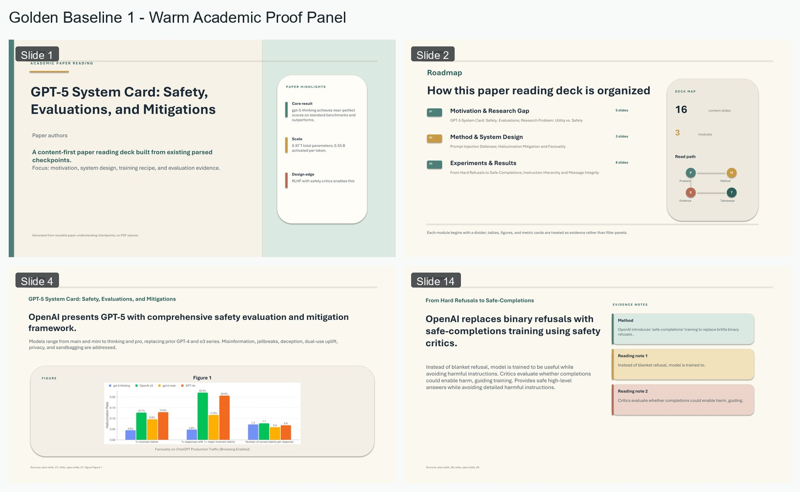
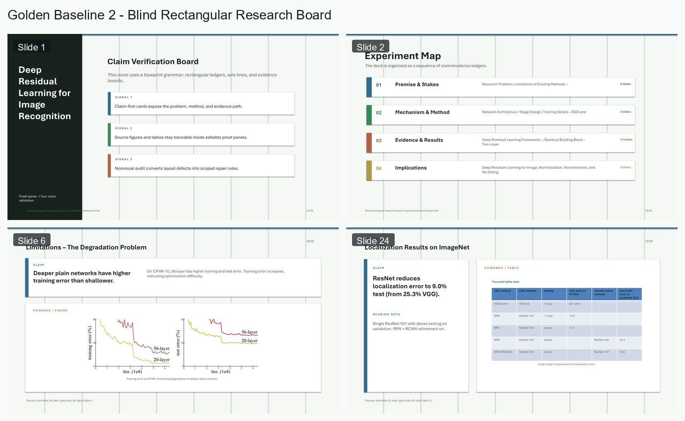

# paper2ppt

[English](README.md) | [中文](README.zh-CN.md)

paper2ppt is primarily a PPTX evaluation benchmark and repair-loop project for paper-reading decks. It also includes a native paper-to-PPTX generator, so the project can create candidate decks, inspect them, compare them against frozen references, and turn human feedback into reusable benchmark rules.

The current project goal is no longer just "generate a deck once." It is an evaluation-first closed loop: parse a paper once, produce or ingest multiple editable PPTX routes, convert every deck into DeckIR, score it with a universal scorecard, preserve audit/repair decisions, and use those records to improve the next template or generator run.

This project is built on ideas and code paths from [HKUDS/Paper2Slides](https://github.com/HKUDS/Paper2Slides), and it also borrows presentation-structuring inspiration from [gejifeng/Paper2PPT](https://github.com/gejifeng/Paper2PPT). The main implementation in this repository is still the `paper2slides/`-based workflow, heavily modified for text-only LLM calls and native PPTX generation.


## Visual Golden References

The benchmark keeps multiple frozen references so new routes can be evaluated against distinct visual grammars instead of a single preferred template.





## What The Benchmark Measures

The core contribution is the PPTX evaluation loop:

- **Editability**: whether the deck remains native PowerPoint text, shapes, figures, and tables rather than rasterized pages.
- **Content alignment**: whether slide roles, section coverage, claims, details, and evidence match the parsed paper checkpoints.
- **Evidence grounding**: whether figures, tables, metrics, captions, and source-like notes are present and traceable.
- **Layout geometry**: overlap, overflow, safe-area use, whitespace balance, table fit, figure fit, and component boundaries.
- **Typography and copy fitting**: font comfort, type hierarchy, capacity risk, clipped text, and low-density or overfull regions.
- **Style and repair risk**: frozen-reference scope, style drift, risky auto-repair, and rules that need human calibration.

The generator is useful because it supplies candidate decks for this loop. The evaluator is the project center: it decides which route is stable, which style has plateaued, which visual rule needs human feedback, and which template can be promoted.

## Project Lineage And Changes

From HKUDS/Paper2Slides, this project keeps the useful paper-processing foundation:

- PDF parsing and source asset extraction.
- Summary, content planning, and checkpoint-style reruns.
- A command-line workflow for turning a paper into presentation material.

The first major change is the generation path. The original image-style slide path has been replaced with a lower-cost, text-only LLM workflow:

- The model plans structured slide specs instead of generating slide images.
- `python-pptx` renders native editable PowerPoint objects: text boxes, shapes, tables, and inserted source figures.
- Model calls use OpenAI-compatible chat-completions settings; the default template is configured for DeepSeek.
- The workflow generates a matching `speaker_script.md`.
- Spec and layout QA check for empty components, clipped text, weak metric cards, truncated ellipses, missing numbered-point fields, layout/payload mismatches, and decorative elements that do not carry information.
- Numbered points are represented with structured `claim`, `detail`, and `evidence` fields before rendering.
- The deck now has presentation structure: title page, contents page, section dividers, key-message blocks, numbered claim/detail/evidence points, source figures, and compact metric cards.

The second major change is the evaluation path. The repository now treats PPTX as an inspectable structured artifact rather than only a visual output:

- Parse-once checkpoints allow one paper to feed multiple style routes without paying repeated parsing cost.
- Nonvisual PPTX audit checks geometry, typography, text capacity, table/figure use, evidence structure, and repair risk from PowerPoint metadata.
- DeckIR converts native PPTX files into a common intermediate representation, so generated decks, frozen baselines, human-made PPTX files, and other PPT generators can be compared by the same benchmark.
- Universal scorecard v0 reports editability, content alignment, evidence grounding, layout geometry, typography, visual-design proxies, and human-feedback status.
- Repair logs and frozen references make every style experiment reproducible instead of relying on a one-off visual impression.

From gejifeng/Paper2PPT, this project mainly borrows product ideas rather than runtime code:

- Stronger section-aware paper storytelling.
- A more detailed companion-material mindset for long technical papers.
- Optional lightweight Beamer/TeX sidecar generation implemented inside this repository.

This repository does not vendor Paper2PPT and does not depend on it at runtime.

## Current Evaluation Capabilities

The project now supports:

- Parse-once benchmark runs that branch one paper into frozen baselines, seed-template drafts, and experimental routes.
- Metadata-only `nonvisual-audit` for PPTX quality detection without screenshot-heavy review.
- Universal PPTX intake that writes `deck_ir.json`, `universal_scorecard.v0.json`, and schema files for generated or external decks.
- Six-way and universal benchmark runners for comparing route quality, repair logs, style drift, score curves, and artifact completeness.
- Content-alignment checks that compare native PPTX text against summary, plan, and slide-spec checkpoints.
- Human-feedback packets and visual rule registries that keep subjective complaints separate from deterministic failures.
- Protected frozen references: `academic`, `golden_baseline1_from_scratch_warm_academic`, and `golden_baseline2_blind_rectangular_research_board`.
- PPT-master-inspired seed pipeline gates: strategist, spec lock, seed template package, visual probe, template gate, human-feedback packet, and full-deck seed renderer.

## Generation Capabilities

The generation branch supplies candidate artifacts for the benchmark:

- Editable PowerPoint output: `slides.pptx`.
- A matching narration draft: `speaker_script.md`.
- An optional lightweight Beamer/TeX sidecar generated by this repository's own code. This is a reference/backup path, not the main deliverable.
- LangChain/LangGraph-based text LLM orchestration.
- DeepSeek/OpenAI-compatible text model configuration via `.env`.
- Optional exact slide count with `--slides`.
- Section-aware decks with title page, contents page, section dividers, key-message blocks, structured numbered points, compact metric cards, source figures, and tables.
- Spec-aware evaluator plus PPTX layout QA before the deck enters the universal benchmark layer.
- Bounded repair loop that reworks failed slide specs before rerendering.
- Layout normalization for unsupported LLM layout names and visual/table layouts without matching payload.
- Split model routing: text generation uses `deepseek-v4-flash`; image/multimodal calls use `gpt-5-mini`.
- Deterministic fallback generation with `PPTX_FORCE_DETERMINISTIC=1` for cheap reruns from existing checkpoints.

## Recommended Test PDF

The current main local test paper is:

```text
test_papers/DeepSeek_V4.pdf
```

The latest checked output during development was generated under:

```text
outputs/DeepSeek_V4/paper/fast/slides_academic_medium_24slides/
```

Additional cross-paper checks have also been run with:

```text
test_papers/Deep Residual Learning for Image Recognition.pdf
test_papers/Thinking_with_Visual_Primitives.pdf
test_papers/mHC：Manifold-Constrained Hyper-Connections.pdf
```

The exact timestamped folder changes per run. A successful run should include:

```text
slides.pptx
speaker_script.md
layout_qa.json
```

Some runs may also include:

```text
detailed_slides.tex
detailed_slides.pdf
```

Those TeX/PDF files are optional reference artifacts. The primary deliverables are still `slides.pptx` and `speaker_script.md`.

## How It Works

```text
PDF
 -> parsing and source asset extraction
 -> summary checkpoint
 -> content plan checkpoint
 -> LangGraph PPTX workflow
    -> source packet
    -> optional source-figure understanding
    -> text LLM deck curation
    -> slide spec validation and numbered-point normalization
    -> native PPTX rendering
    -> spec evaluator + layout QA
    -> failed-slide repair loop
    -> speaker script generation
    -> optional detailed Beamer/TeX sidecar generation
 -> benchmark / evaluation layer
    -> nonvisual PPTX audit
    -> DeckIR intake for generated or external PPTX
    -> universal scorecard v0
    -> repair log, score curve, and frozen-reference comparison
```

For a diagram and interview-friendly explanation of the evaluator-driven loop, see [Agentic PPTX Workflow](docs/agent_workflow.md).

The generated PPTX is not a screenshot deck. It uses native PowerPoint text boxes, shapes, tables, and inserted source images, so it remains editable in PowerPoint.

## Requirements

- Windows, macOS, or Linux
- Python 3.10 or newer; Python 3.12 is recommended
- Conda or another Python environment manager
- A text-model API compatible with the OpenAI chat-completions interface

The project has been developed in a local conda environment named `paper2slides`, but the name is not required.

## Installation

```powershell
conda create -n paper2ppt python=3.12
conda activate paper2ppt
pip install -r requirements.txt
```

If you already have a suitable Python environment:

```powershell
pip install -r requirements.txt
```

## Configure the API

paper2ppt reads API settings from:

```text
paper2slides/.env
```

For public GitHub safety, only the template should be committed:

```text
paper2slides/.env.example
```

If setting up a new clone, create the local env file from the template:

```powershell
copy paper2slides\.env.example paper2slides\.env
```

Do not commit the local `paper2slides/.env` file.

Typical configuration:

```env
RAG_LLM_API_KEY=your_api_key_here
RAG_LLM_BASE_URL=https://api.deepseek.com
LLM_MODEL=deepseek-v4-flash
RAG_LLM_MAX_TOKENS=8192
RAG_FAST_INCLUDE_IMAGES=1
RAG_VISION_MODEL=gpt-5-mini
RAG_VISION_API_KEY=your_openai_or_vision_api_key_here
```

Optional PPTX-specific model override:

```env
PPTX_LLM_MODEL=deepseek-v4-flash
```

If model calls are not needed and you only want to rerender from existing checkpoints:

```env
PPTX_FORCE_DETERMINISTIC=1
```

Optional figure understanding:

```env
PPTX_ENABLE_FIGURE_ANALYSIS=auto
PPTX_VISION_MODEL=gpt-5-mini
PPTX_VISION_API_KEY=your_openai_or_vision_api_key_here
PPTX_MAX_FIGURE_ANALYSIS=5
```

This optional step analyzes source paper figures. It does not generate new images. In `auto` mode, it only runs when figure captions look too weak for reliable slide curation. Use `1` to force it on or `0` to force it off. Keep text and multimodal routing separate: DeepSeek handles text calls, while `gpt-5-mini` handles image payloads when they are enabled.

In fast paper mode, redundant `paper_info` RAG querying is skipped because paper metadata is extracted directly from parsed markdown during summary generation.

## Quick Evaluation Run

Evaluate any editable PPTX first:

```powershell
python -m paper2slides.benchmark universal-pptx-intake `
  --pptx path\to\deck.pptx `
  --output-dir benchmark_runs\local_intake\deck_a `
  --write-schemas
```

This writes:

```text
deck_ir.json
universal_scorecard.v0.json
nonvisual_audit.json
```

Use this path for generated decks, manually edited decks, frozen references, and PPTX files from other generators.

## Generate A Candidate Deck

Typical run:

```powershell
python -m paper2slides --input test_papers\DeepSeek_V4.pdf --output slides --style academic --length medium --slides 24 --fast
```

Cheap rerun from existing checkpoints:

```powershell
$env:PPTX_FORCE_DETERMINISTIC="1"
python -m paper2slides --input test_papers\DeepSeek_V4.pdf --output slides --style academic --length medium --slides 24 --fast --from-stage generate
```

Main options:

```text
--input       PDF file path
--output      slides
--style       academic or a custom style description
--length      short, medium, or long
--slides      exact target content-slide count; overrides --length
--fast        use direct parsing/query flow instead of full indexing
--from-stage  rag, summary, plan, or generate
--list        list previous outputs
--debug       print more logs
```

Dynamic slide count:

```text
short   roughly 8-12 content slides
medium  roughly 14-22 content slides
long    roughly 24-36 content slides
```

Use `--slides 24` or a similar explicit value for long papers that need fuller coverage.

## Output Files

Typical timestamped output folder:

```text
outputs/<project_name>/paper/fast/slides_academic_medium_24slides/<timestamp>/
```

Typical files:

```text
slides.pptx
speaker_script.md
layout_qa.json
checkpoint_slide_spec.json
checkpoint_slide_spec_llm_raw.txt
nonvisual_audit.json
deck_ir.json
universal_scorecard.v0.json
repair_log.json
```

Meaning:

- `slides.pptx`: editable PowerPoint deck.
- `speaker_script.md`: slide-by-slide narration draft.
- `detailed_slides.tex` / `detailed_slides.pdf`: optional reference artifacts generated by the local sidecar code when enabled and when `pdflatex` is available.
- `layout_qa.json`: spec and layout QA result, including warnings and failed slide indexes.
- `checkpoint_slide_spec.json`: final structured slide specification, including `claim`, `detail`, and `evidence` for numbered points.
- `checkpoint_slide_spec_llm_raw.txt`: raw LLM output when a curator call was used.
- `nonvisual_audit.json`: deterministic PPTX quality detection over metadata, geometry, typography, text capacity, tables, figures, and repair risk.
- `deck_ir.json`: universal DeckIR representation for comparing native PPTX decks across generators.
- `universal_scorecard.v0.json`: cross-deck benchmark scorecard with editability, content, evidence, layout, typography, visual proxy, and feedback dimensions.
- `repair_log.json`: bounded repair and materialization record for benchmark routes.

## Important Implementation Files

```text
paper2slides/generator/text_pptx_workflow.py
paper2slides/generator/pptx_renderer.py
paper2slides/generator/pptx_qa.py
paper2slides/generator/slide_schema.py
paper2slides/generator/spec_builder.py
paper2slides/generator/content_planner.py
paper2slides/generator/detailed_tex.py
paper2slides/core/stages/rag_stage.py
paper2slides/core/stages/generate_stage.py
paper2slides/core/paths.py
paper2slides/benchmark/nonvisual_audit.py
paper2slides/benchmark/sixway.py
paper2slides/benchmark/universal/deck_ir.py
paper2slides/benchmark/universal/pptx_intake.py
paper2slides/benchmark/universal/runner.py
paper2slides/benchmark/seed_pipeline/strategist.py
paper2slides/benchmark/seed_pipeline/template_package.py
paper2slides/benchmark/seed_pipeline/template_gate.py
paper2slides/benchmark/seed_pipeline/full_deck_renderer.py
```

## Test

```powershell
python -m unittest test_phase1_pptx.py
```

## PPTX Benchmark And Evaluation Loop

The repository now includes a universal benchmark layer for turning generated or external PPTX files into comparable quality evidence:

```powershell
python -m paper2slides.benchmark --outputs outputs --report-dir benchmark_runs\local_history
```

The legacy command above scans existing `layout_qa.json` files, groups warnings into stable badcase categories, and writes `qa_summary.md` plus `qa_summary.json`. The newer benchmark layer operates directly on PPTX artifacts:

```powershell
python -m paper2slides.benchmark nonvisual-audit `
  --pptx path\to\slides.pptx `
  --output path\to\nonvisual_audit.json

python -m paper2slides.benchmark universal-pptx-intake `
  --pptx path\to\slides.pptx `
  --output-dir benchmark_runs\local_intake\deck_a `
  --write-schemas
```

The universal intake writes `deck_ir.json`, `universal_scorecard.v0.json`, and optional schema files. Because DeckIR is source-agnostic, the same evaluator can score:

- paper2ppt generated decks;
- PPT-master-inspired seed-template decks;
- manually edited PowerPoint files;
- frozen golden baselines;
- decks produced by other PPT generators, as long as they are editable PPTX files.

For a parse-once multi-route smoke run, use the six-way runner:

```powershell
python -m paper2slides.benchmark sixway `
  --paper test_papers\OpenAI_GPT-5_System_Card.pdf `
  --run-dir benchmark_runs\openai_gpt5_system_card_sixway_20260701_smoke `
  --slides 24
```

The current benchmark direction is:

- keep parse-once checkpoints, native PPTX output, nonvisual audit, six-way benchmark, repair logs, and frozen references;
- preserve `academic`, `golden_baseline1`, and `golden_baseline2` as evaluation references, not as templates for new autonomous style proposals;
- use PPT-master-inspired strategist/spec-lock/seed-template/quality-gate ideas for the initial style pipeline;
- compare all routes through DeckIR and universal scorecard before relying on human visual preference;
- convert useful human feedback into durable, style-scoped benchmark rules.

The paper manifest lives in `benchmarks/papers.json`; the `ai20` set combines local papers with additional model, reasoning, and agent/evaluation reports.

Useful planning and run reports:

```text
docs/benchmark_plan.zh-CN.md
docs/multistyle_aesthetic_benchmark_plan.zh-CN.md
docs/from_scratch_benchmark_final_synthesis.zh-CN.md
docs/next_window_handoff.zh-CN.md
docs/ppt_master_universal_benchmark_upgrade_plan.zh-CN.md
docs/ppt_master_seed_pipeline_integration_plan.zh-CN.md
docs/universal_ppt_benchmark_v0_report.zh-CN.md
docs/three_seed_styles_openai_gpt5_report.zh-CN.md
docs/golden_baseline2_cover_signal_patch.zh-CN.md
docs/ppt_evaluation_project_repositioning_report.zh-CN.md
```

To validate the `ai20` paper set:

```powershell
C:\Users\81001\.conda\envs\paper2slides\python.exe -m paper2slides.benchmark.papers validate --set ai20
```

To redownload missing `ai20` papers on a fresh machine, run:

```powershell
.\benchmarks\download_ai20.ps1
```

To run the batch benchmark over `ai20`:

```powershell
C:\Users\81001\.conda\envs\paper2slides\python.exe -m paper2slides.benchmark.runner run --set ai20 --styles academic --slides 24 --resume
```

For a low-risk smoke run, add `--limit 1`. Reports are written under `benchmark_runs/<set>_<timestamp>/`.

Quick syntax check without writing `__pycache__`:

```powershell
$env:PYTHONDONTWRITEBYTECODE="1"
python -c "import ast, pathlib; ast.parse(pathlib.Path('paper2slides/generator/pptx_renderer.py').read_text(encoding='utf-8')); print('AST OK')"
```

## Troubleshooting

If the API call fails:

- Check `paper2slides/.env`.
- Check `RAG_LLM_BASE_URL`.
- Check whether the selected model supports the needed context length.

If the deck is too sparse or too dense:

- Try a different `--length`.
- Use `--slides 24` or another explicit count.
- Rerun from `--from-stage generate`.

If the endpoint is unstable or you want a cheap rerun:

- Set `PPTX_FORCE_DETERMINISTIC=1`.

If a slide looks crowded or clipped:

- Inspect `layout_qa.json`.
- Rerender previews from the saved PPTX if possible.

## Attribution

paper2ppt is derived from [HKUDS/Paper2Slides](https://github.com/HKUDS/Paper2Slides) and takes presentation-design inspiration from [gejifeng/Paper2PPT](https://github.com/gejifeng/Paper2PPT). Keep the upstream attribution and license terms when redistributing or extending this project.
