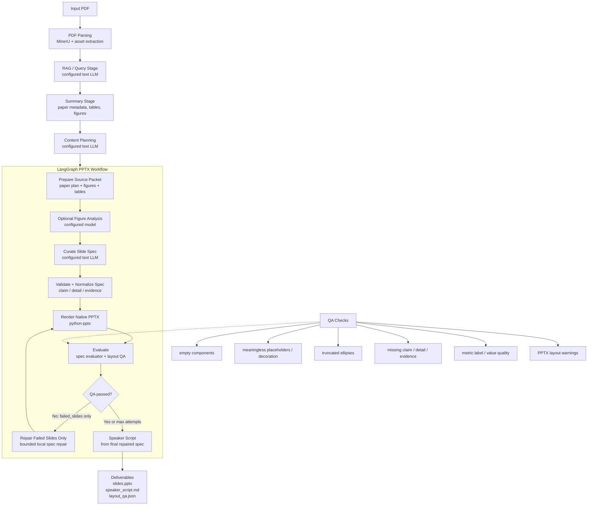

# Agentic PPTX Workflow

paper2ppt uses a bounded, evaluator-driven agentic workflow for native PPTX generation. The workflow is implemented with LangGraph when available, with deterministic fallbacks for local reruns.

It is best described as a **Plan-and-Solve style generation loop with ReAct-like observe/evaluate/repair behavior**:

- The LLM plans paper content and curates the first structured deck spec.
- The system renders the spec into native editable PPTX.
- The evaluator observes both the slide spec and rendered PPTX layout.
- If severe defects are found, only failed slide specs are repaired and rerendered.
- The loop stops when QA passes or the repair limit is reached.

This is not a fully general autonomous ReAct agent that freely chooses arbitrary tools. The tool graph is fixed and production-oriented, which makes the output more predictable for document generation.



## Interview Explanation

The project does not simply ask a model to write slides once. It first asks the model to produce a structured slide plan, then treats the deck as an intermediate program: a schema that can be validated, rendered, inspected, repaired, and rerendered.

The agentic part is the closed loop:

1. **Plan**: the configured text LLM turns paper evidence into a structured `PresentationSpec`.
2. **Act**: the renderer turns the spec into native PowerPoint objects.
3. **Observe**: the evaluator inspects the spec and rendered PPTX layout.
4. **Repair**: only failed slide specs are modified.
5. **Repeat**: the deck is rerendered until QA passes or the attempt limit is reached.

The fixed graph is intentional. For presentation generation, predictable tool boundaries are safer than an unconstrained agent: the system can still iterate, but it cannot wander away from the deliverables.

## How To Study This Project With GPT

If you are learning agents from this repository, give GPT this file plus the repository link or zip, then ask it to teach the project in layers. A useful prompt is:

```text
I know very little about AI agents. Please teach me the agentic part of this paper2ppt project using docs/agent_workflow.md and the repository code.

Start from the workflow diagram, then explain:
1. What is the goal of the agentic workflow?
2. Which parts are LLM calls and which parts are deterministic tools?
3. Why this is Plan-and-Solve style.
4. Which part is ReAct-like observe/evaluate/repair.
5. Why it is not a fully open-ended ReAct agent.
6. How the QA/repair loop improves PPT generation.
7. What code files implement each node.
8. What interview questions I might be asked, and how to answer them.

Use simple language first, then gradually map each idea to code.
```

The concepts to learn are:

| Agent concept | Meaning in this project | Main code |
| --- | --- | --- |
| Planner | Turns paper evidence into a slide/content plan. | `content_planner.py`, `plan_stage.py` |
| State | Carries the plan, source packet, spec, QA warnings, and output paths through the graph. | `_PptxWorkflowState` in `text_pptx_workflow.py` |
| Tool / action | Deterministic operations such as parsing, rendering PPTX, inspecting layout, writing script. | `pptx_renderer.py`, `pptx_qa.py` |
| Observation | QA report from spec checks and rendered PPTX layout checks. | `evaluate_presentation_spec`, `inspect_pptx_layout` |
| Repair | A bounded update to failed slide specs only. | `_qa_repair_node` |
| Stop condition | QA passes or max repair attempts are reached. | `_route_after_render` |

For interviews, the most important distinction is:

- **Classical open ReAct agent**: the LLM repeatedly decides what tool to call next.
- **This project**: the graph is fixed, but it still has an agentic loop: plan, act, observe, repair, repeat.

That distinction is a strength for this use case. PPT generation needs stable, reproducible artifacts, not unconstrained exploration.

## Model Calls And Cost

The main API calls in a full run are:

1. **RAG/query calls**: ask structured questions over the parsed paper; their answers feed summary extraction. In fast mode, paper metadata is extracted directly from markdown, so the redundant `paper_info` RAG query is skipped.
2. **Summary extraction calls**: consolidate metadata, motivation, methods, results, tables, and figures into a usable summary checkpoint.
3. **Content planning call**: creates the section-level slide plan.
4. **Deck curator call**: creates the final compact `PresentationSpec` used by `python-pptx`.
5. **Auto/optional figure analysis call**: describes extracted figures for better visual placement when captions look too weak. This uses the configured vision model, not the DeepSeek text model.

The first four categories feed the final `slides.pptx` and `speaker_script.md`. The figure analysis call only matters when it returns usable `figure_analyses`; if `figure_analysis_count` is `0`, it did not affect the final deck. The current cost-aware setup keeps text and multimodal routing separate: `deepseek-v4-flash` handles text calls, while `gpt-5-mini` handles image payloads in the fast RAG/query stage (`RAG_VISION_MODEL`) and optional figure analysis (`PPTX_VISION_MODEL`).

The TeX/Beamer sidecar (`detailed_slides.tex` and `detailed_slides.pdf`) is generated locally from the final plan/spec. It does not call the LLM and does not add API cost.

## From Workflow QA To Benchmark QA

The single-deck loop answers: "Is this generated deck usable?"

The next benchmark loop answers a larger question: "Which template, layout policy, and repair rule works best across papers, and how does each iteration improve quality?"

The planned benchmark now has two tracks. The first track keeps the current `academic` template as a golden baseline and preserves companion styles such as `academic_warm`, `editorial`, `editorial_mono`, and `data_report` for stable regression. The second track is a from-scratch template experiment: reuse parsed paper content, but do not reuse the golden baseline visual skeleton. Instead, build a content inventory, create a rough complete draft, design slide roles and proof objects, add a new visual system, then evaluate reliability, content quality, layout quality, aesthetics, and novelty against the baseline.

The benchmark should score five dimensions:

- **Reliability**: generated artifacts, QA pass rate, severe warning rate, missing artifacts, repair success.
- **Content organization**: section coverage, TOC alignment, slide role balance, claim/detail/evidence completeness.
- **Visual layout**: overflow, alignment, whitespace balance, figure readability, metric/table readability.
- **Aesthetics**: palette harmony, contrast, typography consistency, visual hierarchy, style consistency, presentation polish.
- **Novelty**: for from-scratch templates only, measure whether the new style still depends on the golden baseline's header rhythm, key-message block, slide role pattern, and macro page skeleton.

This turns aesthetic judgment into a structured evaluation problem. The project can then show curves such as warning rate decreasing, pass rate increasing, aesthetic score improving, and baseline similarity decreasing for genuinely new templates after each targeted iteration.

## 中文面试讲法

这个项目里的 agent 不是“让一个大模型自由决定下一步调用什么工具”的开放式 ReAct agent，而是一个更适合生产交付的固定图 agentic workflow。

如果要把这个文件交给 GPT 帮你学习，可以直接这样问：

```text
我对 AI agent 几乎一窍不通。请基于这个仓库和 docs/agent_workflow.md，带我学会 paper2ppt 里的 agent 部分。

请按以下顺序讲：
1. 先用大白话解释这张 Mermaid 图。
2. 再解释 Plan-and-Solve 在项目里对应哪几步。
3. 再解释 ReAct-like 的 Observe / Evaluate / Repair 是什么。
4. 告诉我哪些步骤真的调用了大模型，哪些是确定性工具。
5. 对照代码文件讲每个节点在哪里实现。
6. 最后模拟面试官追问，训练我怎么回答。
```

可以这样解释：

1. 先由配置的文本模型（当前为 `deepseek-v4-flash`）做内容规划，把论文压缩成结构化 `PresentationSpec`。
2. 系统把这个 spec 当作中间程序，而不是直接相信模型输出。
3. 渲染器执行这个程序，生成原生可编辑 PPTX。
4. evaluator 同时检查两层结果：一层是 spec 语义质量，例如 numbered point 是否有 `claim/detail/evidence`，metric 是否有合理 label/value；另一层是 PPTX 版式质量，例如空组件、溢出、截断等。
5. 如果发现严重问题，repair loop 只修改失败页面的 slide spec，然后重新渲染和评估。
6. 循环有上限，所以它不是无边界自动探索，而是可控、可复现、面向交付的 agent 闭环。

一句话版本：

> 我们没有做一个自由游走的通用 ReAct agent，而是把论文转 PPT 拆成固定工具图：Plan、Act、Observe、Repair、Repeat。这样保留了 agent 的闭环迭代能力，同时保证 PPT 生成过程稳定可控。

## Non-Visual Observe/Repair Extension

The from-scratch paper-reading deck work adds a second kind of observation: a metadata-only PPTX audit.

Instead of rendering every slide to images and asking a vision model to judge them, the system can inspect the PPTX file as a structured layout program:

- slide roles and section ranges;
- shape positions, sizes, and overlap;
- font sizes by text role;
- text capacity and low-density risk;
- native table rows and columns;
- metric value / label / context grammar;
- layout-family repetition;
- human-feedback badcase rules.

This is still an agentic Observe/Repair loop. The observation is not pixels; it is structured evidence extracted from the generated artifact. The repair step should follow a stable priority order:

```text
content correctness
 -> deck architecture
 -> semantic matching
 -> typography / copy allocation
 -> content-fit optical balance
 -> local component reflow
 -> geometry fix
 -> visual-system revision
```

The important design lesson from the Kimi K2 v5/v6/v10 iterations is that local density metrics must not automatically resize good components, but component geometry also cannot be frozen forever. The stable pattern is:

1. lock the deck-level style contract and typography roles;
2. insert the real slide text into the chosen components;
3. detect whether the fitted content is too empty, too full, visually detached, or boundary-unsafe;
4. resize or reposition only that local component when a content-fit failure exists;
5. reflow same-slide sibling components after any local frame change.

This is why v10 is recorded as a successful candidate style rather than immediately replacing the golden baseline. A style that works on one paper must still be validated on other papers with different figure, table, metric, and text-evidence shapes before promotion.

The human-in-the-loop workflow should convert every useful subjective complaint into a durable benchmark rule:

- "the label and explanation feel disconnected" becomes a paired label/body spacing check;
- "the two-row read path looks stretched" becomes flow-grid column gap, row gap, and label-center checks;
- "the Read path header feels too close to its nodes" becomes an agenda rail header-clearance check;
- "the card frame is too empty after the text is placed" becomes a fitted-text frame overallocation check;
- "the same card spacing feels low in a shallower card" becomes a height-aware internal card stack check;
- "the figure label kisses the rounded border" becomes a component boundary-inset check;
- "the support paragraph on a table page feels dragged toward the table" becomes a table-bottom claim/support/table-panel band-balance check;
- "a long proof caption overflows a short caption box" becomes capacity-aware proof-caption fitting;
- "the long figure becomes unreadable in a side panel" becomes a figure aspect-ratio layout-routing check;
- "the picture is not distorted but still feels squeezed because the panel is the wrong shape" becomes a figure panel aspect-mismatch check;
- "figure labels steal the image's height" becomes a side figure-label rail rule;
- "figure labels stay with the panel corner instead of the fitted image" becomes an image-anchored figure-label check;
- "the table panel looks empty even though the slide spec has rows" becomes an inline-table payload indexing check.

This keeps human taste in the loop without turning the process into manual slide polishing. The human names the visual failure; the system records the badcase, trigger signal, repair strategy, and regression check.

## Benchmark Harness Extension

After the DeepSeek_V4 v25 iteration, the from-scratch warm academic proof-panel style is preserved as `golden_baseline1_from_scratch_warm_academic`. This does not replace the original `academic` golden baseline; it creates a second reference style.

The next workflow layer should be a benchmark harness:

```text
parse PDF once
 -> persist checkpoints
 -> generate multiple style branches
 -> run nonvisual audit
 -> apply style-scoped repair profiles
 -> generate speaker scripts
 -> compare style drift, findings, repairs, cost, and artifacts
 -> write a benchmark report
```

The important change is style scope. Some rules are global correctness rules, such as missing slides, text overflow, table rows missing, image distortion, or shape overlap. Other rules are style-specific polish rules, such as rounded proof-panel identity label anchoring. A style-specific rule can be reported on any deck, but it should only auto-repair a deck when the active style contract matches.

The first harness target should generate three branches from one fresh-paper parse:

1. ordinary `academic`;
2. `golden_baseline1_from_scratch_warm_academic`;
3. `academic` with global benchmark repair, while style-specific polish remains report-only.

This answers the main regression question: can the benchmark improve new decks without damaging the already-good original golden baseline?

In interview terms:

> The project can now evaluate a generated PPT without screenshot-heavy vision review. It treats PPTX as an inspectable program, runs deterministic checks over geometry and text metadata, maps human feedback to benchmark badcases, and repairs only the highest-priority issues. Successful styles become candidate references and must pass cross-paper validation before becoming golden baselines.

Updated phrasing after v25:

> The project now has two protected references: the original `academic` golden baseline and a from-scratch `golden_baseline1`. The benchmark harness parses a paper once, generates multiple style branches, audits them, and applies repairs with style scope so a rule learned from one visual grammar cannot silently damage another.

## 2026-07-01 Update: Frozen References And Hybrid Proposal

After the Deep Residual blind-rectangular work, the project has a third human-tuned frozen reference:

```text
golden_baseline2_blind_rectangular_research_board
```

This changes the benchmark story. The three frozen references are now evaluation branches, not inputs to a future autonomous style generator:

```text
academic
golden_baseline1_from_scratch_warm_academic
golden_baseline2_blind_rectangular_research_board
```

The next agentic layer should add a hybrid `style proposal` step before rendering. For interview stability, this layer has one assisted seed scaffold branch and two autonomous free proposal branches. Both may use the parsed paper content, deck requirements, an abstract design-primitives library, and the badcase registry. Neither may read the complete PPTX, style contract, or layout grammar of the three frozen references.

The intended smoke test now has six branches from one fresh-paper parse:

1. `academic` frozen reference;
2. `golden_baseline1` frozen reference;
3. `golden_baseline2` frozen reference;
4. assisted seed scaffold style;
5. autonomous style proposal A;
6. autonomous style proposal B.

The Observe/Repair loop remains bounded. The assisted seed branch must output a weak `seed_scaffold_contract`, a `seed_authoring_note`, and a `forbidden_reference_attestation`; the autonomous branches must output a `style_contract`, `novelty_report`, and `forbidden_reference_attestation`. All three new-style branches then run 2-3 repair rounds until high/medium findings are gone, two consecutive attempts fail to improve, or a repair-risk rule such as `metric_improved_visual_regressed` is triggered.

Updated interview phrasing:

> We first used human-in-the-loop work to create three frozen PPT style references. Then we separated evaluation from generation: frozen references can be used as baselines, but new-style branches cannot copy their full templates. For the near-term interview demo we run one assisted seed scaffold branch for stability and two autonomous free proposal branches for higher autonomy. That lets us measure the path from human-guided scaffolding toward fully autonomous style proposal instead of pretending the system jumped there in one step.
