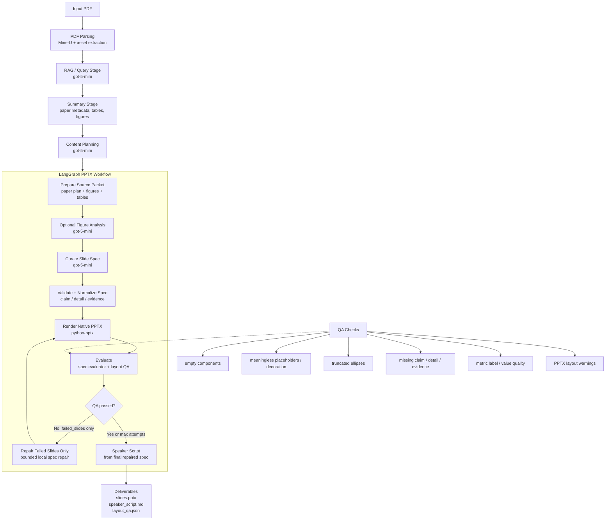

# Agentic PPTX Workflow

paper2ppt uses a bounded, evaluator-driven agentic workflow for native PPTX generation. The workflow is implemented with LangGraph when available, with deterministic fallbacks for local reruns.

It is best described as a **Plan-and-Solve style generation loop with ReAct-like observe/evaluate/repair behavior**:

- The LLM plans paper content and curates the first structured deck spec.
- The system renders the spec into native editable PPTX.
- The evaluator observes both the slide spec and rendered PPTX layout.
- If severe defects are found, only failed slide specs are repaired and rerendered.
- The loop stops when QA passes or the repair limit is reached.

This is not a fully general autonomous ReAct agent that freely chooses arbitrary tools. The tool graph is fixed and production-oriented, which makes the output more predictable for document generation.



## Interview Explanation

The project does not simply ask a model to write slides once. It first asks the model to produce a structured slide plan, then treats the deck as an intermediate program: a schema that can be validated, rendered, inspected, repaired, and rerendered.

The agentic part is the closed loop:

1. **Plan**: `gpt-5-mini` turns paper evidence into a structured `PresentationSpec`.
2. **Act**: the renderer turns the spec into native PowerPoint objects.
3. **Observe**: the evaluator inspects the spec and rendered PPTX layout.
4. **Repair**: only failed slide specs are modified.
5. **Repeat**: the deck is rerendered until QA passes or the attempt limit is reached.

The fixed graph is intentional. For presentation generation, predictable tool boundaries are safer than an unconstrained agent: the system can still iterate, but it cannot wander away from the deliverables.

## How To Study This Project With GPT

If you are learning agents from this repository, give GPT this file plus the repository link or zip, then ask it to teach the project in layers. A useful prompt is:

```text
I know very little about AI agents. Please teach me the agentic part of this paper2ppt project using docs/agent_workflow.md and the repository code.

Start from the workflow diagram, then explain:
1. What is the goal of the agentic workflow?
2. Which parts are LLM calls and which parts are deterministic tools?
3. Why this is Plan-and-Solve style.
4. Which part is ReAct-like observe/evaluate/repair.
5. Why it is not a fully open-ended ReAct agent.
6. How the QA/repair loop improves PPT generation.
7. What code files implement each node.
8. What interview questions I might be asked, and how to answer them.

Use simple language first, then gradually map each idea to code.
```

The concepts to learn are:

| Agent concept | Meaning in this project | Main code |
| --- | --- | --- |
| Planner | Turns paper evidence into a slide/content plan. | `content_planner.py`, `plan_stage.py` |
| State | Carries the plan, source packet, spec, QA warnings, and output paths through the graph. | `_PptxWorkflowState` in `text_pptx_workflow.py` |
| Tool / action | Deterministic operations such as parsing, rendering PPTX, inspecting layout, writing script. | `pptx_renderer.py`, `pptx_qa.py` |
| Observation | QA report from spec checks and rendered PPTX layout checks. | `evaluate_presentation_spec`, `inspect_pptx_layout` |
| Repair | A bounded update to failed slide specs only. | `_qa_repair_node` |
| Stop condition | QA passes or max repair attempts are reached. | `_route_after_render` |

For interviews, the most important distinction is:

- **Classical open ReAct agent**: the LLM repeatedly decides what tool to call next.
- **This project**: the graph is fixed, but it still has an agentic loop: plan, act, observe, repair, repeat.

That distinction is a strength for this use case. PPT generation needs stable, reproducible artifacts, not unconstrained exploration.

## Model Calls And Cost

The main API calls in a full run are:

1. **RAG/query calls**: ask structured questions over the parsed paper; their answers feed summary extraction. In fast mode, paper metadata is extracted directly from markdown, so the redundant `paper_info` RAG query is skipped.
2. **Summary extraction calls**: consolidate metadata, motivation, methods, results, tables, and figures into a usable summary checkpoint.
3. **Content planning call**: creates the section-level slide plan.
4. **Deck curator call**: creates the final compact `PresentationSpec` used by `python-pptx`.
5. **Auto/optional figure analysis call**: describes extracted figures for better visual placement when captions look too weak.

The first four categories feed the final `slides.pptx` and `speaker_script.md`. The figure analysis call only matters when it returns usable `figure_analyses`; if `figure_analysis_count` is `0`, it did not affect the final deck. For cost control, `PPTX_ENABLE_FIGURE_ANALYSIS=auto` runs it only when captions look too weak. Use `1` to force it on or `0` to force it off.

The TeX/Beamer sidecar (`detailed_slides.tex` and `detailed_slides.pdf`) is generated locally from the final plan/spec. It does not call the LLM and does not add API cost.

## 中文面试讲法

这个项目里的 agent 不是“让一个大模型自由决定下一步调用什么工具”的开放式 ReAct agent，而是一个更适合生产交付的固定图 agentic workflow。

如果要把这个文件交给 GPT 帮你学习，可以直接这样问：

```text
我对 AI agent 几乎一窍不通。请基于这个仓库和 docs/agent_workflow.md，带我学会 paper2ppt 里的 agent 部分。

请按以下顺序讲：
1. 先用大白话解释这张 Mermaid 图。
2. 再解释 Plan-and-Solve 在项目里对应哪几步。
3. 再解释 ReAct-like 的 Observe / Evaluate / Repair 是什么。
4. 告诉我哪些步骤真的调用了大模型，哪些是确定性工具。
5. 对照代码文件讲每个节点在哪里实现。
6. 最后模拟面试官追问，训练我怎么回答。
```

可以这样解释：

1. 先由 `gpt-5-mini` 做内容规划，把论文压缩成结构化 `PresentationSpec`。
2. 系统把这个 spec 当作中间程序，而不是直接相信模型输出。
3. 渲染器执行这个程序，生成原生可编辑 PPTX。
4. evaluator 同时检查两层结果：一层是 spec 语义质量，例如 numbered point 是否有 `claim/detail/evidence`，metric 是否有合理 label/value；另一层是 PPTX 版式质量，例如空组件、溢出、截断等。
5. 如果发现严重问题，repair loop 只修改失败页面的 slide spec，然后重新渲染和评估。
6. 循环有上限，所以它不是无边界自动探索，而是可控、可复现、面向交付的 agent 闭环。

一句话版本：

> 我们没有做一个自由游走的通用 ReAct agent，而是把论文转 PPT 拆成固定工具图：Plan、Act、Observe、Repair、Repeat。这样保留了 agent 的闭环迭代能力，同时保证 PPT 生成过程稳定可控。
